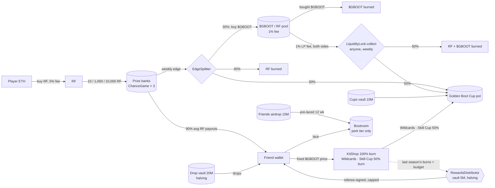

# Penalty Kings economy (tokenomics v2)

**Status:** the public preview's economy is **simulated**. The v2 contracts in `contracts/src` and
`contracts/script/Launch.s.sol` are **not deployed**. [DEPLOYMENT.md](DEPLOYMENT.md) says exactly
what is live on Robinhood mainnet (chain 4663) and links every transaction. Read the
[legal note](#legal-note) before anything else.

Every number below comes from the contracts and the game constants. The formulas are shown next
to the numbers. The tables between `SIM` markers are written by `node scripts/economy-sim.mjs`.
That script first checks that the Solidity sources still hold the constants it uses
(`scripts/lib/tokenomics.mjs`, `checkContracts()`), and it stops with an error if they do not.

## RF first

**You play Penalty Kings with RF.** A ball costs 10 RF (Park), 1,000 RF (Pro) or 10,000 RF
(Champions). Every ball is backed by RF in its stadium's prize bank, and you can redeem it for RF.
The on-chain randomness sets how much RF a ball pays: from 0× to 10× its price, and 90% of the
price on average.

**$GBOOT is optional.** It is a bonus layer for skill and loyalty: drops on each ball, Skill Cup
entries and their capped rewards, Wildcards, cosmetics and lacing perks (cosmetics, XP and Cup
seeding only). You never need $GBOOT to buy a ball, to place it, to redeem it or to enter the
Golden Boot Cup. A player who ignores $GBOOT gets exactly the same RF odds, the same race points
and the same drops.

> **Round 6 revision (not confirmed; for the owner's review).** Three changes:
> 1. **Lacing is progression only.** The Bootroom gives a perk tier 0–3 (cosmetics, XP bonus, Cup
>    seeding). It no longer multiplies race points or drops ([Lacing](#lacing-the-bootroom)).
> 2. **$GBOOT rewards, farm-proofed.** `RewardsDistributor` pays Skill Zone and streak rewards only
>    for paid, referee-signed Skill Cup entries, under per-entry, per-day and per-season caps
>    ([Rewards](#gboot-rewards-rewardsdistributor)).
> 3. **RF-priced sinks, fixed at launch.** KitShop, Wildcards and Skill Cup are priced in RF. At launch
>    they convert at a fixed 0.1 RF per $GBOOT (`GBootFixedPrice`: 100 $GBOOT per entry); the
>    30-minute on-chain TWAP ([TWAP](#rf-priced-sinks-and-the-twap)) needs the audited hook.

> **Owner decision "option B" (2026-09-27): pool fees feed the pot.** The ONE launch default is a
> **plain Uniswap v4 $GBOOT/RF pool with a 1% LP fee and no hook**. `GBootFeeHook` stays designed
> and tested but is off until audited. The protocol-owned positions sit in `LiquidityLock`;
> anyone may call `collect` (weekly) and each fee side is split on-chain: **50% burned, 50% to the
> Golden Boot Cup pot** ([Where the pot comes from](#where-the-pot-comes-from)). Before this
> decision the pool had LP fee 0, so the lock's collect-and-burn collected nothing; the 1% LP fee
> now makes it meaningful.

## How the money moves (v2)

1. **Players buy RF with ETH.** Every RF buy and sell pays Rare Friends' 5% market fee on the ETH
   side. That fee goes to active Friend holders as WETH.
2. **RF buys balls.** The RF goes into the stadium's prize bank, a FriendSDK `ChanceGame`
   contract. The bank reserves the top prize (10 × price) for every ball until the ball settles.
3. **Dice randomness draws a rarity for each ball.** The rarity fixes:
   - the ball's RF value;
   - its $GBOOT drop;
   - its Golden Boot Cup race points.
   **The kick decides no money.**
4. **The 10% edge is split on-chain every week.** The surplus above the opening bank is sent to
   `EdgeSplitter`, less 10% that a growing bank keeps as operator policy. The contract splits it:
   - **40% of the RF is burned**;
   - **30% of the RF buys $GBOOT**, and that $GBOOT is burned (buy-and-burn);
   - **30% of the RF goes to the Golden Boot Cup**.
5. **Pool fees feed the pot and the burn.** The $GBOOT/RF Uniswap v4 pool is a plain pool (no
   hook) with a 1% LP fee, paid on each swap's input side (RF on buys, $GBOOT on sells). The
   locked positions earn it; anyone's `LiquidityLock.collect` splits each side 50% burned / 50%
   to the Cup pot.
6. **$GBOOT comes out of capped vaults only.** Drops, Cups and rewards come from
   `EmissionVault`s. Each vault has an immutable weekly cap; the drop vault's cap halves every
   4 weeks and the rewards vault's every 52 weeks.
7. **$GBOOT sinks** (priced in RF, charged in $GBOOT at the fixed 0.1 RF launch price, i.e. fixed
   $GBOOT amounts; at the 30-minute TWAP only with the audited hook):
   - KitShop cosmetics: 100% burned;
   - Wildcards and Skill Cup entries: 50% burned, 50% to the pot;
   - Bootroom early unlace: 50% burned.



## $GBOOT token and allocation

- **Supply:** `GBoot.TOTAL_SUPPLY` = 100,000,000, minted once at deployment.
- **Admin powers:** none. There is no owner, mint, pause, tax or blacklist. Holders can burn
  their own tokens.
- **Allocation:** `Launch.s.sol` distributes the whole supply in one sequence and checks
  `require(balanceOf(operator) == POOL_GBOOT)`.

| Share | Amount | Where | Release rule (immutable) |
|---:|---:|---|---|
| 55% | 55,000,000 | Pool position A, owned by `LiquidityLock` | Sold only to buyers, from ≈ 0.1003 RF upwards. Locked 180 days (`UNLOCK_DAYS`) |
| 20% | 20,000,000 | Drop vault (`EmissionVault`, halving) | `capOf(w) = 2,500,000 >> ⌊w / 4⌋` per week |
| 10% | 10,000,000 | `FriendsAirdrop` | Merkle claim, laced in the Bootroom for 12 weeks. After 180 days, unclaimed tokens can be swept to the Cups vault |
| 10% | 10,000,000 | Cups & events vault (`EmissionVault`, flat) | ≤ 100,000 per week (100 weeks) |
| 5% | 5,000,000 | Rewards vault: the `RewardsDistributor`'s own `EmissionVault` (halving) | `capOf(w) = 50,000 >> ⌊w / 52⌋` per week, and each 4-week season pays at most the previous season's sink burns |
| 0% | — | Team | none |

- **Operator:** the drop and Cups vaults have one operator, the disclosed game burner
  `0xDB454B035777692EB6bd599297781a7ACC3A25e4`. The operator can only call `release` up to the
  current week's cap. Even a compromised key could take no more than one week's cap per vault.
  The rewards vault's operator is the `RewardsDistributor` contract itself (it creates the vault):
  nobody can release from it except through a valid, capped claim.
- **Price:** the pool starts at the tick-snapped price P₀ = 1.0001^tick ≈ **0.10027 RF per
  $GBOOT**, so the FDV is 100M × P₀ ≈ **10.03M RF**
  (`scripts/onchain/pool-plan.mjs`: tick spacing 200; plain pool, 1% LP fee, no hook).

## Supply over time

The weekly drop cap is `EmissionVault.capOf(w) = weeklyCap >> ⌊w / halvingWeeks⌋`, with
weeklyCap = 2.5M and halvingWeeks = 4. Each 4-week season can therefore release at most 10M,
then 5M, then 2.5M, and so on. After *s* whole seasons the vault can have released at most
**20M × (1 − 2⁻ˢ)**: it approaches 20M and never passes it. The Cups vault is flat: at most
100,000 × *w* after *w* weeks, until it is empty at week 100. The rewards vault releases at most
50,000 a week in year 1, 25,000 in year 2 and so on (2.6M, then 1.3M …), and in practice far less:
a season's rewards budget is also capped by the previous season's sink burns.

Total supply only goes down. It equals 100M minus everything burned. Vault releases move tokens
into circulation but do not change the total supply.

<!-- SIM:supply:START -->
_Generated by `node scripts/economy-sim.mjs` from the contracts and game constants (market snapshot from the RF/WETH and WETH/USDG Uniswap v4 pools at block 73,793,321: 1 RF = $0.00156, 1 ETH = 1,744,926 RF. The game itself shows the LIVE price, read every 60 s from the same pools; see docs/ADDRESSES.md)._

**Schedule (independent of volume).** Week *w* counts from the vault's `start` (week 0 = launch week). Caps are upper bounds; a week's unused cap is lost.

| After week | Drop cap in the last week | Drops released, max (Σ capOf) | Drop vault left, min | Cups vault released, max | Rewards vault released, max | Airdrop unlocked, max | **Max $GBOOT released from vaults** |
|---:|---:|---:|---:|---:|---:|---:|---:|
| 0 | — | 0 | 20,000,000 | 0 | 0 | 0 | **0** |
| 4 | 2,500,000 | 10,000,000 | 10,000,000 | 400,000 | 200,000 | 0 | **10,600,000** |
| 8 | 1,250,000 | 15,000,000 | 5,000,000 | 800,000 | 400,000 | 0 | **16,200,000** |
| 12 | 625,000 | 17,500,000 | 2,500,000 | 1,200,000 | 600,000 | 10,000,000 | **29,300,000** |
| 16 | 312,500 | 18,750,000 | 1,250,000 | 1,600,000 | 800,000 | 10,000,000 | **31,150,000** |
| 26 | 39,063 | 19,765,625 | 234,375 | 2,600,000 | 1,300,000 | 10,000,000 | **33,665,625** |
| 52 | 610 | 19,997,559 | 2,441 | 5,200,000 | 2,600,000 | 10,000,000 | **37,797,559** |
| 78 | 5 | 19,999,971 | 29 | 7,800,000 | 3,250,000 | 10,000,000 | **41,049,971** |
| 104 | 0 | 20,000,000 | 0 | 10,000,000 | 3,900,000 | 10,000,000 | **43,900,000** |

**Total supply (100M minus everything burned), price-responsive.** Each week the edge buy-back buys $GBOOT through the launch positions (A: 55M $GBOOT from 0.1003 RF up; B: a 250,000 RF floor from 0.0101 to 0.0983 RF) and burns it; then drops (auto-scaled to the new price; lacing no longer multiplies them), the full Cups and rewards-vault caps (the rewards vault's real budget is also capped by the previous season's sink burns, so this over-counts it) and, at week 12, the whole airdrop are released and **50% of every release is sold** into the pool. Burns counted: the buy-back only; Skill Cup, Wildcard, KitShop, early-unlace and LP-fee burns are extra. These are stress assumptions, not forecasts.

| Scenario | Ball volume / week | Week 0 | Week 26 | Week 52 | Week 104 | $GBOOT burned by wk 104 | Drops paid by wk 104 | Price wk 104 (RF) |
|---|---:|---:|---:|---:|---:|---:|---:|---:|
| no play | 0 RF ($0.00) | 100,000,000 | 100,000,000 | 100,000,000 | 100,000,000 | 0 | 0 | 0.0101 |
| 50 players/day | 301,000 RF ($469) | 100,000,000 | 94,701,994 | 90,900,463 | 86,535,320 | 13,464,680 | 1,755,957 | 0.1030 |
| 500 players/day | 3,010,000 RF ($4,687) | 100,000,000 | 81,368,973 | 68,960,407 | 54,917,516 | 45,082,484 | 8,978,360 | 0.4128 |
| 5,000 players/day | 30,100,000 RF ($46,866) | 100,000,000 | 42,321,131 | 33,465,109 | 27,142,022 | 72,857,978 | 20,000,000 | 10.0421 |

```text
Drop vault: weekly cap (halves every 4 weeks)            cumulative drops released (max, of 20M)
wk   0 ████████████████████████ 2,500,000   ███·····················   2.50M
wk   4 ████████████············ 1,250,000   ██████████████··········  11.25M
wk   8 ██████··················   625,000   ███████████████████·····  15.63M
wk  12 ███·····················   312,500   █████████████████████···  17.81M
wk  16 ██······················   156,250   ███████████████████████·  18.91M
wk  20 █·······················    78,125   ███████████████████████·  19.45M
wk  24 ························    39,063   ████████████████████████  19.73M
wk  28 ························    19,531   ████████████████████████  19.86M
wk  32 ························     9,766   ████████████████████████  19.93M
wk  36 ························     4,883   ████████████████████████  19.97M
wk  40 ························     2,441   ████████████████████████  19.98M
wk  44 ························     1,221   ████████████████████████  19.99M
wk  48 ························       610   ████████████████████████  20.00M
wk  52 ························       305   ████████████████████████  20.00M

Total supply, "5,000 players/day" (axis 25.00M … 100.00M $GBOOT)
wk   0 ████████████████████████████████████████ 100.00M
wk   8 ██████████████████████··················  66.13M
wk  16 ██████████████··························  51.59M
wk  24 ██████████······························  43.64M
wk  32 ████████································  39.23M
wk  40 ██████··································  36.37M
wk  48 █████···································  34.31M
wk  56 ████····································  32.71M
wk  64 ███·····································  31.43M
wk  72 ███·····································  30.35M
wk  80 ██······································  29.42M
wk  88 ██······································  28.59M
wk  96 ██······································  27.83M
wk 104 █·······································  27.14M
```
<!-- SIM:supply:END -->

**Reading the table:**
- The halving front-loads drops. Up to 50% of the drop vault can go out in the first 4 weeks, but
  only when there is enough volume. Drops are `min(volume-based, capOf)`, and the
  "50 players/day" row pays only a fraction of the cap.
- The "no play" row shows that releases without volume push the price down to the RF floor's
  bottom (≈ 0.01 RF). The total supply does not move, because nothing is burned without play.

## Burns and the deflation needed per volume

The formulas below are per unit of ball volume V (RF):

- edge = 0.10 V (from the odds table; `verify-odds` asserts it);
- sweep = edge × (1 − 0.10), because a growing bank keeps 10%;
- RF burned = 40% × sweep;
- $GBOOT burned = 30% × sweep × 0.99 ÷ P, where 0.99 accounts for the pool's 1% LP fee (that fee
  is paid in RF to the locked positions: half burned, half to the Cup when collected);
- Cup = 30% × sweep.

Drops emitted are 2% × V ÷ P (P = the $GBOOT market price the weekly report reads). The base drop is 2% of the ball price
(`economy.ts`: 0.93 / 93 / 930 = 2% × price ÷ 0.1 ÷ 2.15). Lacing no longer multiplies drops.

<!-- SIM:burn:START -->
_Generated by `node scripts/economy-sim.mjs` from the contracts and game constants (market snapshot from the RF/WETH and WETH/USDG Uniswap v4 pools at block 73,793,321: 1 RF = $0.00156, 1 ETH = 1,744,926 RF. The game itself shows the LIVE price, read every 60 s from the same pools; see docs/ADDRESSES.md)._

Per **1 RF of ball volume** (expected values; the edge is 10%, the growing bank keeps 10% of it):

| Path | Formula | RF per RF of volume | Per $1 of volume |
|---|---|---:|---:|
| RF burned by EdgeSplitter | 0.10 × (1 − 0.10) × 40% | 0.0360 RF | 23.1 RF |
| RF swapped for $GBOOT (buy-back) | 0.10 × 0.90 × 30% | 0.0270 RF | 17.3 RF |
| … its 1% LP fee (paid in RF to the locked positions; `LiquidityLock.collect` burns half, the pot gets half) | 0.027 × 1% | 0.00027 RF (0.000135 burned) | 0.17 RF |
| **$GBOOT bought and burned** | 0.027 × 0.99 ÷ P | **0.2666 $GBOOT** at P = 0.10027 | **171.2 $GBOOT** |
| RF to the Golden Boot Cup | 0.10 × 0.90 × 30% | 0.0270 RF | 17.3 RF |
| **Total RF burned** | 0.036 + 0.027 × 1% × 50% | **0.03614 RF** | **23.2 RF** |
| $GBOOT dropped (emitted) | 2% ÷ price (no lacing multiplier) | 0.1995 $GBOOT | 128.1 $GBOOT |

Both sides scale as 1 ÷ price, so the ratio is price-independent: burned ÷ dropped = 2.673% ÷ 2% = 1.3365 (the LP fee's RF burn is extra). **Ball play is always net deflationary for $GBOOT** (lacing no longer raises drops): every RF of ball volume burns 0.0671 more $GBOOT than it drops at P = 0.10027.

Pool trading adds more: the plain pool charges a 1% LP fee on every swap's input side (RF on buys, $GBOOT on sells). The locked positions earn it, and anyone's weekly `LiquidityLock.collect` burns 50% of each side and sends 50% to the Cup pot, so **1 RF of $GBOOT trading volume burns 0.005 RF-equivalent and adds 0.005 RF-equivalent to the pot** (while the lock holds all of the pool's liquidity; after the 180-day unlock the beneficiary may withdraw the positions, and the fees then follow the NFTs).

**Break-even weekly ball volume** (burns = emissions, the full Cups + rewards-vault releases of 150,000 $GBOOT included, all vaults releasing their full cap; the rewards vault really pays at most the previous season's sink burns, so this is conservative):

| Week | Drop cap | Break-even ball volume |
|---:|---:|---:|
| 0 | 2,500,000 | 2,234,852 RF ($3,480) |
| 4 | 1,250,000 | 2,234,852 RF ($3,480) |
| 8 | 625,000 | 2,234,852 RF ($3,480) |
| 12 | 312,500 | 1,734,944 RF ($2,701) |
| 16 | 156,250 | 1,148,814 RF ($1,789) |
| 20 | 78,125 | 855,749 RF ($1,332) |
| 24 | 39,063 | 709,217 RF ($1,104) |
| 52 | 305 | 563,829 RF ($878) |

Formula: with *b* = 0.02673 ÷ P $GBOOT burned per RF and *d* = 0.02 ÷ P dropped per RF, the break-even volume is V = 150,000 ÷ (b − d) while drops are under the cap, else V = (capOf(week) + 150,000) ÷ b. Above it, total supply falls faster than vaults release.
<!-- SIM:burn:END -->

## Lacing (the Bootroom)

- **Lacing:** you lock $GBOOT against a Friend for 1–52 weeks with
  `Bootroom.lace(friendId, amount, lockWeeks, maxUnlockAt)`. Only the Friend's owner, or its
  token-bound account, starts a lock or moves it to a later unlock (and only they can unlace). The
  `FriendsAirdrop` may also start one (its 12-week pre-lace), but never extends an existing lock.
  Anyone else can only top up a LIVE lock: the amount adds, the unlock and weeks stay (gifts). The
  call reverts when the resulting lock would end after `maxUnlockAt`, so a lace never silently joins
  a longer lock (pass `now + lockWeeks` weeks for exactly the weeks asked).
- **Early unlace:** unlacing before expiry burns 50%.
- **Progress curve:** `progressBps = 10,000 × log₂(1 + x) ÷ log₂(1 + 520,000)`, capped at 100%,
  where x = min(amount, 10,000) × lockWeeks (whole $GBOOT-weeks). The same log curve as before.
- **Perk tier** (`Bootroom.perkTier`): 0 with no live lace, 1 for any live lace, 2 from 50%
  progress (≈ 720 $GBOOT-weeks, e.g. 100 for 8 weeks), 3 from 85% (≈ 72,210 $GBOOT-weeks, e.g.
  10,000 for 8 weeks, or the 12-week airdrop lace).
- **What a perk tier does — progression only:**
  - **cosmetics:** laced-boot variants (glow 1–3, trail, golden laces) shown on the Friend;
  - **XP:** a bonus on XP earned in play (proposed +5 / +10 / +15%); XP, levels and stars are
    progression, never currency;
  - **Cup seeding:** display and draw order in the Cup lists (tier first, then friendId). Seeding
    never breaks a tie for a paid rank: paid ties still go to the lower friendId.
- **What it does not do:** it does not touch race points, drops, RF odds, Cup ranks or $GBOOT
  rewards. The Bootroom no longer exposes `boostBps` or `dropBps` (a Foundry test checks that the
  selectors are gone, and `economy-sim` refuses a Bootroom that has them), and
  `scripts/cup/weekly.mjs` reads `perkTier` only to report it.
- **Why:** a payout multiplier bought by locking $GBOOT is yield. Without it, lacing is a
  commitment signal with cosmetic, XP and seeding perks, and the value of a ball is the same for
  every Friend.

<!-- SIM:lacing:START -->
_Generated by `node scripts/economy-sim.mjs` from the contracts and game constants (market snapshot from the RF/WETH and WETH/USDG Uniswap v4 pools at block 73,793,321: 1 RF = $0.00156, 1 ETH = 1,744,926 RF. The game itself shows the LIVE price, read every 60 s from the same pools; see docs/ADDRESSES.md)._

Perk tier (lacing progress in brackets) for a live lace of *amount* $GBOOT committed for *weeks*. **A perk tier is not a multiplier**: race points, drops, Cup ranks and rewards are identical for every tier.

| Laced | 1 wk | 4 wk | 12 wk | 26 wk | 52 wk |
|---:|---:|---:|---:|---:|---:|
| 1 | T1 (5%) | T1 (12%) | T1 (19%) | T1 (25%) | T1 (30%) |
| 100 | T1 (35%) | T1 (46%) | T2 (54%) | T2 (60%) | T2 (65%) |
| 1,000 | T2 (52%) | T2 (63%) | T2 (71%) | T2 (77%) | T2 (83%) |
| 10,000 | T2 (70%) | T2 (81%) | T3 (89%) | T3 (95%) | T3 (100%) |
| 50,000 | T2 (70%) | T2 (81%) | T3 (89%) | T3 (95%) | T3 (100%) |

What each tier gives (progression; proposed values, the owner decides the exact perks):

| Tier | Progress | XP bonus | Cosmetic | Cup seeding (display / draw order only) | Ball value (RF + drops) |
|---:|---|---:|---|---|---:|
| 0 | 0 (none or expired) | +0% | — | unseeded | 92.00% |
| 1 | > 0 | +5% | laced boots (glow 1) | seed band 3 | 92.00% |
| 2 | ≥ 50% | +10% | glow 2 + boot trail | seed band 2 | 92.00% |
| 3 | ≥ 85% | +15% | glow 3 + golden laces | seed band 1 | 92.00% |
<!-- SIM:lacing:END -->

**What this means:**
- **Cheap perks at the low end:** the log scale makes small laces reach tier 1–2 quickly (100
  $GBOOT for 12 weeks is tier 2). The cap stops any one Friend going past tier 3.
- **Race points are sybil-neutral again:** they are RF per point alone, whatever is laced.
- **The farm bound tightens:** RF return plus drops is 91.9995% of the ball price for every Friend
  (it was up to 93% at the old ×1.5 drop boost). `BootroomFarm.t.sol` asserts ≤ 93% for any lace.

## Airdrop sizing (Friends airdrop, 10M)

- **Setup:** the deployer sets the Merkle root once. The leaf is `keccak256(abi.encode(friendId,
  amount))`.
- **Claiming:** a claim never pays a wallet. It laces the amount for that Friend for 12 weeks,
  so every eligible Friend starts with a perk tier (tier 3 from 6,018 $GBOOT; see the table). If
  the Friend's owner already has a live lock ending at least 12 weeks out, the claim joins it; a
  shorter live lock or an expired lace makes the claim revert until the owner extends or unlaces it
  (a permissionless claim never lengthens the owner's lock). Strangers cannot pre-start the lock.
- **Eligibility:** the rules are published with the root and apply identically to every Friend.
  For example: every Friend hardwired at a published snapshot block, with an equal share each.
  They must not favour any wallet.

<!-- SIM:airdrop:START -->
_Generated by `node scripts/economy-sim.mjs` from the contracts and game constants (market snapshot from the RF/WETH and WETH/USDG Uniswap v4 pools at block 73,793,321: 1 RF = $0.00156, 1 ETH = 1,744,926 RF. The game itself shows the LIVE price, read every 60 s from the same pools; see docs/ADDRESSES.md)._

Equal split of 10,000,000 $GBOOT across N eligible Friends, each laced for 12 weeks:

| Eligible Friends N | $GBOOT per Friend | ≈ RF at launch price | Counted for the perk curve (≤ 10,000) | Perk tier for 12 weeks (progress) | Uncounted $GBOOT (no extra progress) |
|---:|---:|---:|---:|---:|---:|
| 250 | 40,000 | 4,011 | 10,000 | T3 (89%) | 7,500,000 |
| 500 | 20,000 | 2,005 | 10,000 | T3 (89%) | 5,000,000 |
| 1,000 | 10,000 | 1,003 | 10,000 | T3 (89%) | 0 |
| 2,000 | 5,000 | 501 | 5,000 | T2 (84%) | 0 |
| 5,000 | 2,000 | 201 | 2,000 | T2 (77%) | 0 |
| 10,000 | 1,000 | 100 | 1,000 | T2 (71%) | 0 |
| 20,000 | 500 | 50 | 500 | T2 (66%) | 0 |

Unclaimed $GBOOT can be swept to the Cups & events vault after the 180-day window (≈ 25.7 weeks). The vault's flat 100,000/week cap does not change, so a sweep of S $GBOOT extends its runway by S ÷ 100,000 weeks (a full 10M sweep: +100 weeks).
<!-- SIM:airdrop:END -->

**The sizing rule:** only the first 10,000 $GBOOT laced per Friend count towards the perk curve
(`MAX_LACE`). A per-Friend amount above 10,000 buys no extra progress; that is the case whenever
N < 1,000 eligible Friends under an equal split. Since perks are progression only, the owner may
prefer a smaller per-Friend amount (tier 3 for 12 weeks needs ≈ 6,018) and a larger N.

## Sudden Death solvency

In a Big Match, 3+ goals in the first 5 kicks unlock Sudden Death: every goal scores ×2 until the
first miss.

<!-- SIM:suddendeath:START -->
_Generated by `node scripts/economy-sim.mjs` from the contracts and game constants (market snapshot from the RF/WETH and WETH/USDG Uniswap v4 pools at block 73,793,321: 1 RF = $0.00156, 1 ETH = 1,744,926 RF. The game itself shows the LIVE price, read every 60 s from the same pools; see docs/ADDRESSES.md)._

Big Match rule: after 5 kicks with 3+ goals, every further goal scores ×2 until the first miss. Expected extra kicks for goal rate *p* (geometric run) and the most one kick can score (`packages/engine` goalPoints: 100 × keeper ≤ 2.5 × ball × streak ≤ 2 (×1.2 at 3, ×1.5 at 5, ×2 at 10 in a row) × Sudden Death 2 × top bin 5 × post-in 1.5):

| Goal rate p | P(reach Sudden Death) = P(≥3 of 5) | Expected Sudden Death kicks, p ÷ (1 − p) | P(run ≥ 10 goals) = p¹⁰ |
|---:|---:|---:|---:|
| 55% | 59.3% | 1.22 | 0.25% |
| 60% | 68.3% | 1.50 | 0.60% |
| 65% | 76.5% | 1.86 | 1.35% |

Largest single-kick score ≤ 7,500 points × the ball multiplier. **Points carry zero RF or $GBOOT liability**: every RF payout was fixed by Dice when the ball was placed (the prize bank reserved 10 × price for it), and the Skill Cup referee scores with Sudden Death off (`verifier/src/core.ts`: `goalPoints(…, false, …)`) over exactly 5 kicks.
<!-- SIM:suddendeath:END -->

- **The same rule covers every skill prize.** Anything paid for skill comes from a fixed pot or a
  capped vault, and it is paid by rank or by a rule that is published before the week starts.
  Nothing is paid per point.
- **The rewards vault:** $GBOOT for skill is paid only by `RewardsDistributor`, for paid,
  referee-judged Skill Cup entries, within the per-entry, per-day and per-season caps below. It is
  never paid from the prize banks.
- **No per-goal bounty on balls:** Big Match Sudden Death runs in the browser and the kick decides
  no money, so a $GBOOT bounty per Sudden Death goal cannot be farm-proofed. Sudden Death goals
  earn XP and stars only.

## Prize-bank solvency and capacity

Every stadium uses the same outcome table:

- chances 31.5% / 27% / 20% / 11% / 7% / 2.5% / 1%;
- payouts 0 / 0.5 / 1 / 1.5 / 2.5 / 5 / 10 × the ball price.

The expected payout is exactly 0.90 (`scripts/verify-odds.mjs`, run in CI). A stadium can hold
free bank ÷ (10 × price) balls in flight. When a stadium is full, the game says so before any
transaction.

<!-- SIM:solvency:START -->
_Generated by `node scripts/economy-sim.mjs` from the contracts and game constants (market snapshot from the RF/WETH and WETH/USDG Uniswap v4 pools at block 73,793,321: 1 RF = $0.00156, 1 ETH = 1,744,926 RF. The game itself shows the LIVE price, read every 60 s from the same pools; see docs/ADDRESSES.md)._

Per ball, in units of the ball price: mean payout 0.90, standard deviation **1.329**, edge **0.10**, variance 1.768.

| Loss barrier (ball prices) | Simulated P(ever reached) | Normal approx. exp(−2·edge·N/σ²) | Exact upper bound exp(−θ·N), θ = 0.0944 |
|---:|---:|---:|---:|
| 10 | 3.22e-1 | 3.23e-1 | 3.89e-1 |
| 20 | 1.24e-1 | 1.04e-1 | 1.51e-1 |
| 30 | 4.87e-2 | 3.36e-2 | 5.89e-2 |
| 40 | 1.90e-2 | 1.08e-2 | 2.29e-2 |
| **100** | (too rare to sample) | 1.22e-5 | **7.93e-5** |

20,000 runs × 20,000 balls per barrier. The exact Lundberg bound sits above every simulated value, so "a bank ever falls 100 ball prices below its start" has probability **at most ≈ 8e-5**. Only the surplus above the opening bank is swept (high-water sweep), so the drift always applies below the start.

| Stadium | Ball | Top prize | Opening bank | Balls in flight (bank ÷ top prize) |
|---|---:|---:|---:|---:|
| park | 10 RF | 100 RF | 20,000 RF | 200 |
| pro | 1,000 RF | 10,000 RF | 200,000 RF | 20 |
| champions | 10,000 RF | 100,000 RF | 2,000,000 RF | 20 |
<!-- SIM:solvency:END -->

## Golden Boot Cup and Skill Cup

**Golden Boot Cup (weekly: luck and volume)**

- **Pot sources** (sized in [Where the pot comes from](#where-the-pot-comes-from)):
  - 30% of the swept edge (`EdgeSplitter`);
  - 50% of Wildcard spend (and 50% of Skill Cup entries, paid out to the Skill Cup ranking);
  - 50% of the pool's trading fees (`LiquidityLock.collect`);
  - up to 100,000 $GBOOT a week from the Cups vault;
  - an optional RF seed.
- **Race points:**
  - Gold = 1 point and Golden Boot = 2 points;
  - × the stadium weight (Park 1, Pro 100, Champions 1,000, the same as the price ratio);
  - no lacing multiplier: the same for every Friend.
- **Payouts:** the top 10 are paid 25 / 18 / 13 / 10 / 8 / 7 / 6 / 5 / 4 / 4 %.
- **Wildcards:** one extra draw costs 10 RF (`Wildcards.PRICE_RF`), paid in $GBOOT: a fixed 100
  $GBOOT at launch (at the 30-minute TWAP only with the audited hook), with 1% Golden Boot and
  2.5% Gold odds and no RF payout. Balls are the cheaper route to race points unless $GBOOT falls
  about 90% below its launch price (farm check below).

**Skill Cup (weekly: skill)**

- **Entry:** `SkillCup.ENTRY_RF` = 10 RF, paid in $GBOOT: a fixed 100 $GBOOT at launch
  (`GBootFixedPrice`; at the 30-minute TWAP only with the audited hook). 50% is burned and 50% goes to the pot. The entrant's `maxGbootIn` bounds the cost.
- **Eligibility:** Friends hardwired at Gen 4 or better.
- **Limits:** one entry per Friend per hour and 20 per week.
- **Refereeing:** the referee (`verifier/`) replays 5 kicks per entry against a keeper whose dive
  is derived from a secret committed in advance. It scores without Sudden Death. After the 5th
  kick it also signs the entry's $GBOOT reward claims (EIP-712, [Rewards](#gboot-rewards-rewardsdistributor)).
- **Status:** simulated in the preview. Going live needs a bridge extension from Rare Friends
  (recorded as a capability gap).

## Where the pot comes from

The Golden Boot Cup pot is one address (`CUP_POT` in `Launch.s.sol`, by default the disclosed
game wallet). Five things fill it:

1. **A starting seed.** Optional and one-off. The contracts start the pot at zero; the operator
   may add RF to it. The public preview shows a simulated 500,000 RF.
2. **30% of the game's edge.** Every ball keeps 10% of its price on average (the edge). Each
   week `EdgeSplitter` sends 30% of that edge to the pot in RF.
3. **Half of every Wildcard and Skill Cup entry.** Each costs 100 $GBOOT at launch. Half is
   burned; the other half goes to the pot. (The Skill Cup half is paid to the Skill Cup ranking.)
4. **Half of the pool's trading fees.** Every trade in the $GBOOT/RF pool pays a 1% fee to the
   locked liquidity. Anyone can call `LiquidityLock.collect` once a week: half of the fees are
   burned and half go to the pot, for both RF and $GBOOT. This is enforced by the contract.
5. **The Cups vault.** Up to 100,000 $GBOOT a week (a cap, not a promise), for 100 weeks.

The table below is produced by `node scripts/economy-sim.mjs` (function `weeklyPot`), so the
numbers can be reproduced and the assumptions changed. They are estimates, not promises.

<!-- SIM:pot:START -->
_Generated by `node scripts/economy-sim.mjs` from the contracts and game constants (market snapshot from the RF/WETH and WETH/USDG Uniswap v4 pools at block 73,793,321: 1 RF = $0.00156, 1 ETH = 1,744,926 RF. The game itself shows the LIVE price, read every 60 s from the same pools; see docs/ADDRESSES.md)._

**Assumptions (change them in `scripts/economy-sim.mjs`, `POT_ASSUME` and `MIX`):**

- **Players:** 80% play park (10 RF) × 15 balls a day; 18% play pro (1,000 RF) × 3 balls a day; 2% play champions (10,000 RF) × 1 balls a day.
- **Edge:** 10% of ball spend, and **30% of the edge goes to the Cup**. Steady state: the prize banks are no longer growing (while a bank grows, the operator keeps 10% of its surplus first, so the edge line is 10% lower). Expected values, no luck.
- **Entries:** each daily player makes 0.2 Skill Cup entries and 0.1 Wildcard draws a day; each costs 100 $GBOOT (fixed launch price) and 50% goes to the pot.
- **Pool:** "trading volume" is outside $GBOOT/RF swaps per week, half buys (fee paid in RF) and half sells (fee paid in $GBOOT); the edge buy-back swap is added on top. The LP fee is 1%, the locked positions hold all the liquidity, and `LiquidityLock.collect` sends 50% of each side to the pot.
- **Cups vault:** the operator releases the full 100,000 $GBOOT weekly cap into the pot (it is a cap, not a promise).
- **Value:** $GBOOT counted at the fixed 0.1 RF launch price; USD at the market snapshot above.

**Pot inflows by source, per week** (trading volume 0 here; pool fees are in the next table):

| Daily players | Ball spend | 30% of the edge (RF) | Skill Cup halves ($GBOOT) | Wildcard halves ($GBOOT) | Buy-back LP fee to pot (RF) | Cups vault ($GBOOT) | **Total, RF-equivalent** |
|---:|---:|---:|---:|---:|---:|---:|---:|
| 50 | 301,000 RF | 9,030 | 3,500 (70 entries) | 1,750 (35 draws) | 45.2 | 100,000 | **19,600** ($30.52) |
| 500 | 3,010,000 RF | 90,300 | 35,000 (700 entries) | 17,500 (350 draws) | 451.5 | 100,000 | **106,002** ($165) |
| 5,000 | 30,100,000 RF | 903,000 | 350,000 (7,000 entries) | 175,000 (3,500 draws) | 4,515.0 | 100,000 | **970,015** ($1,510) |

**Pool trading fees to the pot, per week** (on top of the table above):

| Weekly $GBOOT trading volume | LP fees (1%) | Burned (50%) | To the pot: RF side | To the pot: $GBOOT side | **To the pot, RF-equivalent** |
|---:|---:|---:|---:|---:|---:|
| 10,000 RF | 100 RF-eq. | 50 RF-eq. | 25 RF | 250 $GBOOT | **50** |
| 100,000 RF | 1,000 RF-eq. | 500 RF-eq. | 250 RF | 2,500 $GBOOT | **500** |
| 1,000,000 RF | 10,000 RF-eq. | 5,000 RF-eq. | 2,500 RF | 25,000 $GBOOT | **5,000** |

**Weekly pot size, RF-equivalent** (everything above; in brackets: without the Cups vault, i.e. only what the contracts send automatically):

| Daily players ↓ / weekly trading volume → | 10,000 RF | 100,000 RF | 1,000,000 RF |
|---:|---:|---:|---:|
| 50 | **19,650** (9,650) | **20,100** (10,100) | **24,600** (14,600) |
| 500 | **106,052** (96,052) | **106,502** (96,502) | **111,002** (101,002) |
| 5,000 | **970,065** (960,065) | **970,515** (960,515) | **975,015** (965,015) |

Reading it: at 50 players a day the pot is about $30.60 a week, and the Cups vault is 51% of it. At 5,000 players the game's edge dominates (93% of the pot). Pool fees matter only at high trading volume: 1M RF of trading adds 5,000 RF-equivalent a week. **Starting seed** (one-off, not in the table): the contracts start the pot at 0; the operator may add an optional RF seed (the public preview simulates 500,000 RF, `SIM_CUP_SEED_RF`).
<!-- SIM:pot:END -->

## $GBOOT pool

- **Venue (launch default):** Uniswap v4, $GBOOT/RF, a **plain pool: 1% LP fee, tick spacing 200,
  no hook**. `GBootFeeHook` (fee burn + TWAP accumulator, hook flags `0x10C4`) stays designed and
  fork-tested but is off until audited; turning it on means a new pool (the hook is part of the
  pool key) and new sink deployments priced by `GBootPriceFeed`.
- **Position A:** 55M $GBOOT single-sided from P₀ up to ≈ 99.46 RF (≈ 1,000×). It needs no RF.
- **Position B:** optional. An RF floor from ≈ 0.01 to ≈ 0.098 RF. That RF is at market risk: it
  turns into $GBOOT if $GBOOT is sold down.
- **Lock:** both positions belong to `LiquidityLock` until the unlock time (180 days by default).
  After that the beneficiary (the burner) can withdraw the NFTs.
- **Fees:** the 1% LP fee accrues to the locked positions on each swap's input side. Anyone may
  call `LiquidityLock.collect(tokenId)`: the caller receives nothing, and each side is split
  burned = ⌊fees × 50%⌋, pot = fees − burned (the odd wei goes to the pot, nothing stays in the
  lock). RF is burned with `RF.burn` (verified in [ADDRESSES.md](ADDRESSES.md)), $GBOOT with
  `GBoot.burn`. The lock is reentrancy-guarded and fuzz/invariant-tested (fees in = burned + pot).
  After the unlock time the beneficiary may withdraw the positions, and the fees then follow the
  NFTs.

<!-- SIM:pool:START -->
_Generated by `node scripts/economy-sim.mjs` from the contracts and game constants (market snapshot from the RF/WETH and WETH/USDG Uniswap v4 pools at block 73,793,321: 1 RF = $0.00156, 1 ETH = 1,744,926 RF. The game itself shows the LIVE price, read every 60 s from the same pools; see docs/ADDRESSES.md)._

Position A: 55,000,000 $GBOOT single-sided from 0.10027 to 99.46 RF per $GBOOT (tick-snapped by pool-plan.mjs). L = 17,987,135. Start FDV = 100M × 0.10027 = **10,027,037 RF** ($15,612). RF in = L·(√P₁ − √P₀) ÷ 0.99; $GBOOT out = L·(1/√P₀ − 1/√P₁).

| Price move | New price (RF) | RF that must flow in | ≈ USD | $GBOOT bought out of the pool |
|---|---:|---:|---:|---:|
| ×2 | 0.201 | 2,383,073 | $3,710 | 16,637,382 |
| ×10 | 1.003 | 12,440,120 | $19,369 | 38,840,709 |
| ×100 | 10.027 | 51,779,235 | $80,620 | 51,123,219 |
<!-- SIM:pool:END -->

## Farm checks

The live drop base is `min(schedule, 2% × ball price ÷ P ÷ 2.15)` (P = the $GBOOT market price,
the weekly report's `--twap` input), capped each week by the
drop vault's `capOf`. It is published in [DROPS.md](DROPS.md) before that week's drops are paid.
Lacing does not multiply it.

<!-- SIM:farm:START -->
_Generated by `node scripts/economy-sim.mjs` from the contracts and game constants (market snapshot from the RF/WETH and WETH/USDG Uniswap v4 pools at block 73,793,321: 1 RF = $0.00156, 1 ETH = 1,744,926 RF. The game itself shows the LIVE price, read every 60 s from the same pools; see docs/ADDRESSES.md)._

RF payout is always 90%. Drops are valued at the $GBOOT market price; there is no lacing multiplier any more:

| $GBOOT price | Drop value, fixed schedule | Total, fixed | Drop value, auto-scaled | **Total, auto-scaled** |
|---|---:|---:|---:|---:|
| 0.1× (0.0100 RF) | 0.20% | 90.20% | 0.20% | **90.20%** |
| 1× (0.1003 RF) | 2.00% | 92.00% | 2.00% | **92.00%** |
| 10× (1.0027 RF) | 20.05% | 110.05% | 2.00% | **92.00%** |
| 100× (10.0270 RF) | 200.49% | 290.49% | 2.00% | **92.00%** |

### Wildcard farm check (RF cost per Golden Boot race point)

A Park ball costs 10 RF and returns 9 RF on average plus its drop; a Wildcard returns nothing. **Launch default (no hook):** a Wildcard costs a fixed 100 $GBOOT (`GBootFixedPrice`, 10 RF at 0.1 RF per $GBOOT), so its RF cost moves with the market price. **With the audited hook** it would cost 10 RF of $GBOOT at the 30-minute TWAP at every price. Both give 0.045 expected race points; lacing multiplies neither.

| $GBOOT price | Park ball, net RF per point | **Wildcard, RF per point (launch default: fixed 100 $GBOOT)** | Wildcard with the audited hook (TWAP) | … hook worst case: spot 10.5% under the TWAP | Cheaper route (launch default) |
|---|---:|---:|---:|---:|---|
| 0.1× (0.0100 RF) | 21.78 | **22.28** | 222.22 | 201.08 | balls |
| 1× (0.1003 RF) | 17.78 | **222.82** | 222.22 | 201.08 | balls |
| 10× (1.0027 RF) | 17.78 | **2,228.23** | 222.22 | 201.08 | balls |
| 100× (10.0270 RF) | 17.78 | **22,282.31** | 222.22 | 201.08 | balls |

**Launch default, known limit:** with fixed $GBOOT prices, a Wildcard is the cheaper route to race points only if $GBOOT trades below **0.0098 RF** (≈ 0.098× the launch price, a 90.2% fall). The weekly report takes the market price as an operator input (`scripts/cup/weekly.mjs --twap`, not read on-chain), so the operator can see it coming; the structural fix is the audited hook, whose RF pricing removes the break-even: a Wildcard then costs 10 RF of $GBOOT at every price (≥ 9.05 RF at spot under the divergence guard), while a ball's net cost per point never exceeds 22.22 RF. Skill Cup entries (100 $GBOOT) and KitShop items (listed $GBOOT prices) are fixed the same way; their farm check is in $GBOOT and does not depend on the price (see Rewards).
<!-- SIM:farm:END -->

## RF-priced sinks and the TWAP

**Launch default: fixed prices.** The plain pool has no hook, so there is no on-chain TWAP. The
sinks and `RewardsDistributor` read `GBootFixedPrice` instead: a fixed 0.1 RF per $GBOOT, so a
Skill Cup entry or a Wildcard costs 100 $GBOOT, a kit costs its listed $GBOOT price, and the
per-entry reward cap is 20 $GBOOT. Everything below describes the **upgrade path with the audited
hook**, where the same contracts read `GBootPriceFeed` (the 30-minute TWAP) instead.

**Formulas** (all three sinks use `GBootPriceFeed.gbootForRf(priceRf, roundUp = true)`):

- tick̄ = the arithmetic-mean tick of the $GBOOT/RF pool over the last 30 minutes (`GBootFeeHook.consult`);
- sqrtP = `TickMath.getSqrtPriceAtTick(tick̄)`; the pool price is currency1 per currency0 = sqrtP² ÷ 2¹⁹²;
- RF per $GBOOT: P̄ = sqrtP² ÷ 2¹⁹² if $GBOOT is currency0, else 2¹⁹² ÷ sqrtP²;
- **$GBOOT charged = ⌈price_RF ÷ P̄⌉**, and the call reverts unless it is ≤ the caller's `maxGbootIn`;
- rewards use the same conversion rounded down: **$GBOOT paid = ⌊rfValue ÷ P̄⌋**.

| Sink | RF price (fixed) | At P̄ = 0.10027 | Split |
|---|---:|---:|---|
| `KitShop.buy(friendId, itemId, maxGbootIn)` | `priceRf[item]` = the economy.ts $GBOOT price × 0.1 (0 – 1.5 RF) | e.g. 0.6 RF → 5.98 $GBOOT | 100% burned |
| `SkillCup.enter(friendId, maxGbootIn)` | `ENTRY_RF` = 10 RF | 99.73 $GBOOT | 50% burned, 50% to the pot |
| `Wildcards.draw(friendId, maxGbootIn)` | `PRICE_RF` = 10 RF | 99.73 $GBOOT | 50% burned, 50% to the pot |

Each sink also records its burns per week (`burnedInWeek`, 0-based from the launch `start`), which
sets the next rewards budget.

**The accumulator (why the TWAP is exact).** Uniswap v4 has no built-in oracle, so `GBootFeeHook`
keeps one. In `beforeSwap` (the first swap in each second) it adds `tick × seconds elapsed`, using
the pool's tick *before* the swap, which is the tick that held since the previous write; the tick
only changes in swaps, so the running sum is exact. It stores a ring of 64 checkpoints at least
60 s apart (≥ 63 minutes of history). `consult(period)` returns the mean tick over a window that
starts at most 60 s before `now − period` (exactly at it whenever the checkpoints allow), reads
the current tick for the time since the last swap, and reverts until the pool has a full period
of history. `afterInitialize` seeds it and refuses to run if the hook's address flags are not
exactly `0x10C4` (otherwise `beforeSwap` would never be called).

**Manipulation window and period.** To move a 30-minute TWAP by a factor k, an attacker must hold
the pool price at k × fair for the whole 30 minutes against arbitrage (a one-block pump held for
t seconds moves the mean tick by only t ÷ 1,800 of the pump; `ForkHook.t.sol` measures it on the
real PoolManager). What the attacker could gain is bounded by what the TWAP prices:

- pushing P̄ **up** makes sinks cheaper in $GBOOT: the gain is a discount on items that pay no RF
  (burned cosmetics, a 10 RF Wildcard or entry), while holding the pump costs ≫ the discount (moving
  the launch position ×2 takes ≈ 2.38M RF of buying);
- pushing P̄ **down** makes rewards bigger in $GBOOT: capped at 2 RF-equivalent per paid entry, 3 RF
  per Friend per day and the season budget, so the gain per 30 minutes of holding is a few RF per
  Friend.

30 minutes is long enough that holding a manipulated price costs more than any of these gains,
and short enough that honest prices follow the market within the hour (a 60-minute period is
possible up to `MAX_PERIOD`).

**Stale-price / divergence guard.** `GBootPriceFeed` reverts (`PriceUnstable`) while the spot tick
is more than 1,000 ticks (≈ 10.5%) away from the TWAP. That covers the TWAP lagging a real move
(nobody can buy sinks at a stale price more than ≈ 10% off, or claim rewards at one) and a pump in
progress. The TWAP never uses data older than period + 60 s, and it cannot go stale in a quiet
pool: if nobody swapped, the current tick held over the whole window and the TWAP equals it.
Callers' `maxGbootIn` adds the per-transaction slippage bound (the Clubhouse uses quote + 2%).

## $GBOOT rewards (RewardsDistributor)

`contracts/src/RewardsDistributor.sol` pays Skill Zone and challenge-streak rewards in $GBOOT.
A claim pays **only if all of these hold** (each is a Foundry test):

| Guard | Enforced | How |
|---|---|---|
| Referee authorised it | on-chain | EIP-712 signature (`RewardClaim(uint256 friendId,uint256 entryId,uint8 kind,uint256 rfValue,uint256 nonce,uint256 deadline)`, domain "Penalty Kings Rewards" v1, chain id, contract) from the immutable `referee`; low-s only |
| Hardwired, generation ≤ 4 | on-chain | `Generations.generation(friendId)` read at claim time: 0 → `NotHardwired`, > 4 → `GenerationTooLow` (verified on-chain: `generation(7730)` = 3; the SDK's `chain.js` and `ChanceGame` use the same `generation(uint256) returns (uint8)`) |
| A paid entry of that Friend | on-chain | `SkillCup.entryFriend(entryId) == friendId` (the entry burned 5 RF of $GBOOT) |
| Per-entry cap | on-chain | Σ rewards for the entry ≤ 20% of `ENTRY_RF` = 2 RF-equivalent (skill + streak) |
| Per-Friend daily cap | on-chain | Σ rewards per Friend per day ≤ 3 RF-equivalent |
| Replay | on-chain | per-Friend nonce, used once (the referee uses nonce = entryId × 4 + kind) |
| Expiry | on-chain | `deadline` passed → `Expired`; deadline more than 7 days ahead → `DeadlineTooFar` |
| Season budget | on-chain | Σ paid in a season ≤ budget(s) (invariant-tested) |
| Price sane | on-chain | audited hook only: the TWAP feed's readiness and divergence guards (the launch default's fixed price cannot fail) |
| What the entry earned | referee (off-chain) | 5 goals 1.5 RF, 4 goals 1 RF, 3 goals 0.5 RF; streak 0.5 RF on the first finished entry of a day after ≥ 3 consecutive days (`verifier/src/rewards.ts`) |

The payment goes to the Friend's token-bound account; anyone may submit the claim.

**Season budget** (4-week seasons, the rewards vault's weeks):

> budget(s) = min( Σ_{w ∈ season s} `vault.capOf(w)`, Σ_sinks Σ_{w ∈ season s−1} `burnedInWeek(w)`, vault balance )

`setSeasonBudget()` is permissionless, sets it once per season from on-chain reads only (the
sinks' own burn ledgers: KitShop, SkillCup, Wildcards; the Bootroom's early-unlace burn is not
counted), and `claim` calls it lazily. The sink volume does **not** come from the operator.
Unused budget does not roll over, and season 0 pays nothing.

<!-- SIM:rewards:START -->
_Generated by `node scripts/economy-sim.mjs` from the contracts and game constants (market snapshot from the RF/WETH and WETH/USDG Uniswap v4 pools at block 73,793,321: 1 RF = $0.00156, 1 ETH = 1,744,926 RF. The game itself shows the LIVE price, read every 60 s from the same pools; see docs/ADDRESSES.md)._

Every $GBOOT reward is tied to a **paid** Skill Cup entry (`SkillCup.entryFriend(entryId) == friendId`), a hardwired Friend of generation ≤ 4, a referee EIP-712 signature, a nonce and a deadline ≤ 7 days. Values are signed in RF and converted to $GBOOT (rounded down) at the fixed 0.1 RF per $GBOOT (launch default, `GBootFixedPrice`), or at the 30-minute TWAP with the audited hook. At the fixed price both the entry and the reward are fixed $GBOOT amounts (100 and at most 20), so the shares below hold at every market price.

**Per paid entry** (RF-equivalent at the price source):

| Item | RF | Share of the entry |
|---|---:|---:|
| Entry price (`SkillCup.ENTRY_RF`) | 10 | 100% |
| Burned | 5 | 50% |
| To the pot (paid by rank to the week's best scores) | 5 | 50% |
| Most rewards for the entry (skill ≤ 1.5 + streak 0.5; `ENTRY_CAP_BPS`) | 2 | 20% |
| … audited hook only: at spot, spot up to 10.5% above the TWAP (divergence guard) | 2.21 | 22.1% |
| **Entrant's best case: max reward + the whole pot back** (hook worst case; 70% at the fixed price) | **7.21** | **72.1%** |

So an entry returns at most 72.1% of its price even if one player wins every pot: farming rewards loses ≥ 2.79 RF per entry. The per-Friend daily cap (3 RF) needs ≥ 2 paid entries (20 RF, 10 RF burned).

**Per ball** (the 10% edge): rewards are not attached to balls, so a ball's value is unchanged:

| Stadium | RF return | Drops (at the price) | Rewards | **Total** | Edge kept |
|---|---:|---:|---:|---:|---:|
| park (10 RF) | 90.00% | 2.00% | 0.00% | **92.00%** | 8.00% |
| pro (1,000 RF) | 90.00% | 2.00% | 0.00% | **92.00%** | 8.00% |
| champions (10,000 RF) | 90.00% | 2.00% | 0.00% | **92.00%** | 8.00% |

A player mixing balls and entries gets back at most max(92.00%, 72.1%) = 92.00% of every RF spent: the $GBOOT value per RF (drops + rewards) never reaches the 10% edge.

**Per season** (4 weeks): budget(s) = min(Σ capOf of the rewards vault over the season, $GBOOT burned by KitShop + SkillCup + Wildcards in season s − 1, vault balance), fixed once by the permissionless `setSeasonBudget()`. Rewards therefore never exceed the previous season's sink burns: they recycle burned $GBOOT and cannot inflate supply on net. Season 0 pays nothing (no previous season).

| Skill Cup entries / week | Wildcards / week | Sink burns per season (P = launch) | Ceiling, season 1 | **Budget, season 2** | Most the entries can claim (all at the per-entry cap) | Binding |
|---:|---:|---:|---:|---:|---:|---|
| 50 | 50 | 19,946 | 200,000 | **19,946** | 3,989 | per-entry caps |
| 500 | 200 | 139,622 | 200,000 | **139,622** | 39,892 | per-entry caps |
| 5,000 | 1,000 | 1,196,764 | 200,000 | **200,000** | 398,921 | halving ceiling |
| 20,000 | 5,000 | 4,986,518 | 200,000 | **200,000** | 1,595,686 | halving ceiling |

Not paid in $GBOOT (cannot be farm-proofed, so progression only: XP, stars, cosmetics): **daily login** (costs nothing, so any $GBOOT per login is a sybil faucet), **practice / Daily-challenge scores** (played in the browser, not judged by the referee), **Big Match Sudden Death goals** (client-side), and the **Bootroom perk tier**.
<!-- SIM:rewards:END -->

**What is enforced on-chain and what is assumed:** everything in the table except the reward
schedule is enforced by the contract. The referee decides only how much of the 2 RF per-entry
allowance an entry earned, and whether a streak happened (its secret, replay and signature are
public at week end). A compromised referee key could at most pay 2 RF-equivalent per paid entry
and 3 RF per Friend per day, within the season budget; every such claim still needs a real paid
entry of a gen ≤ 4 Friend.

## Weekly scale table

<!-- SIM:scale:START -->
_Generated by `node scripts/economy-sim.mjs` from the contracts and game constants (market snapshot from the RF/WETH and WETH/USDG Uniswap v4 pools at block 73,793,321: 1 RF = $0.00156, 1 ETH = 1,744,926 RF. The game itself shows the LIVE price, read every 60 s from the same pools; see docs/ADDRESSES.md)._

Assumptions: 80% of players at park × 15 balls/day, 18% of players at pro × 3 balls/day, 2% of players at champions × 1 balls/day; 5% of a stadium's daily players have a ball in flight at the peak; 25% of RF spent is bought fresh with ETH. Burn and Cup figures use the realised surplus of the simulated week (luck included), after the 10% growth retention. Drops (no lacing multiplier), before and after the drop vault's week-0 and week-26 caps.

| Daily players | RF spent / wk | RF burned (40%) | $GBOOT bought & burned (30%) | Cup RF (30%) | Friend fees / wk | Drops / wk (uncapped) | Cap wk 0 / wk 26 binds? | Peak bank need vs opening bank |
|---:|---:|---:|---:|---:|---:|---:|---|---|
| 50 | 301,000 RF ($469) | 13,236 RF | 98,010 | 9,927 RF | 0.002 ETH | 59,106 | no / yes | 200 / 10,000 / 100,000 vs 20,000 / 200,000 / 2,000,000 |
| 500 | 3,010,000 RF ($4,687) | 109,975 RF | 814,365 | 82,482 RF | 0.023 ETH | 599,781 | no / yes | 2,000 / 50,000 / 100,000 vs 20,000 / 200,000 / 2,000,000 |
| 5,000 | 30,100,000 RF ($46,866) | 1,050,879 RF | 7,781,737 | 788,159 RF | 0.227 ETH | 6,017,270 | yes / yes | 20,000 / 450,000 / 500,000 vs 20,000 / 200,000 / 2,000,000 |

Skill Cup (10 RF) and Wildcards (10 RF), paid in $GBOOT (a fixed 100 $GBOOT each at launch), burn 50% of every entry on top: each 1,000 entries burn 5,000 RF worth of $GBOOT (49,865 $GBOOT at the launch price).
<!-- SIM:scale:END -->

## Why hold $GBOOT

These are the things $GBOOT *does* in the game. None of them is a promise about its price.

- **Lace your boots.** Lacing $GBOOT against your Friend gives a perk tier: laced-boot cosmetics,
  an XP bonus and Cup seeding. It does not change any payout.
- **Enter the Skill Cup.** Entry costs 100 $GBOOT (10 RF at the launch price) per shootout; the Cup is the only prize in
  the game decided by skill, and a good shootout earns a capped $GBOOT reward (≤ 20% of the entry).
- **Buy Wildcards.** 100 $GBOOT (10 RF at the launch price) buys an extra Golden Boot draw.
- **Buy cosmetics.** Boots, kits, nets and celebrations from the KitShop (the $GBOOT is burned).
- **Fixed rules:** a fixed supply, no team allocation, no owner or mint, capped vaults, and burns
  that are written into the contracts. Anyone can check them on-chain.

**The downsides, just as plainly:**
- $GBOOT can fall to a small fraction of its launch price, or to zero.
- Early unlace burns half of the lace.
- The pool positions unlock after 180 days.
- Perks end when a lace expires.
- Rewards never cover an entry: at most 20% of it comes back as $GBOOT.
- Holding $GBOOT never changes the RF odds of a ball.

## Legal note

- **Not investment advice.** Nothing in this repository is investment, financial, legal or tax
  advice, or an offer to sell anything.
- **No promise of returns.** $GBOOT is a game token with in-game uses. Nobody promises it any
  price, yield, buy-back volume or return. The burns and caps above describe what the contracts
  do; they are not a forecast. The projections use stated stress assumptions and will be wrong in
  practice.
- **How the game's prizes work:** the game's RF prizes are decided by **on-chain randomness**
  (Dice), with a **90% average return** per ball. The kick, the player's skill, lacing and
  $GBOOT do not change these odds. Over many balls a player should expect to get back less RF
  than they spend.
- **Legal review:** token-priced random rewards need legal review in each jurisdiction before any
  official launch. Play only where it is lawful for you.

## Creator commitments

- **Edge splits:** the weekly edge goes through `EdgeSplitter`, never by hand. Its 40/30/30 split
  is fixed in the contract.
- **Weekly report:** [WEEKLY.md](WEEKLY.md) gets a report every week. It covers:
  - the edge split transaction;
  - vault releases against `capOf`;
  - every Friend's Bootroom perk tier (reported; never applied to a payout) and the Cup seeding;
  - the rewards season budget and what was paid;
  - the drop base;
  - the Cup table.

  `node scripts/cup/weekly.mjs` computes it from on-chain events. It is a dry run that only
  reads and never signs.
- **Burns** use each token's `burn`, never a transfer to a dead address.

## Roadmap

- **Launch default (owner decision "option B"):** a plain pool with a 1% LP fee and no hook; the
  fees feed the pot and the burn through `LiquidityLock`. Nothing is deployed; every v2 contract
  needs an audit and Rare Friends review first.
- **After an audit:** `contracts/src/GBootFeeHook.sol` (1% hook fee burned on both sides + the
  TWAP accumulator) and `GBootPriceFeed` switch the sinks to RF prices at the TWAP. That needs a
  new pool and new sink deployments.
- **Later:**
  - PvP keepers on the same replay referee;
  - clubs and seasons;
  - stadium naming rights auctioned for $GBOOT (burned).
