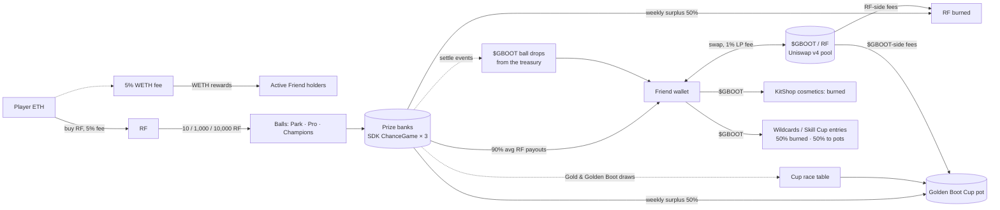

# Penalty Kings economy

**Status:** the public preview's economy is **simulated**. This document describes the live
design. [DEPLOYMENT.md](DEPLOYMENT.md) says exactly which parts are deployed on Robinhood mainnet
(chain 4663) and links every transaction. Nothing here is financial advice. Token-priced random
rewards need legal review before any official launch.

## How the money moves (plain English)

1. **Players buy RF** (Rare Friends' token) with ETH. Every buy and sell of RF pays a 5% fee on
   the ETH side, and that fee goes to active Rare Friends holders as WETH rewards.
2. **RF buys balls.** A ball costs 10 RF in the Park, 1,000 RF in Pro and 10,000 RF in
   Champions. The RF goes into that stadium's **prize bank**, which is a FriendSDK chance-game
   contract.
3. **Every ball has a rarity**, drawn by on-chain randomness (Dice). The rarity decides three
   things:
   - how much RF the ball can be redeemed for (0× to 10× its price; 90% on average);
   - its **$GBOOT drop**;
   - whether it counts for the weekly **Golden Boot Cup** race (only Gold and Golden Boot balls
     do).
4. **The kick decides no money.** Kicking only earns score, streaks, badges and leaderboard
   places. A bot that fakes perfect kicks earns nothing extra.
5. **The bank keeps 10% on average (the edge).** The weekly surplus above the bank's opening
   level is split:
   - **half is burned as RF**, which reduces RF supply;
   - **half goes to the Golden Boot Cup**.

   While a stadium is still growing, 10% of that surplus stays in the bank so it can hold more
   balls at once.
6. **$GBOOT is the game token.** It has a fixed supply of 1 billion and no owner, minting or tax.
   It trades against **RF** in a Uniswap v4 pool, so anyone buying $GBOOT must first buy RF.
   That means more RF demand and more fees for Friend holders.
7. **$GBOOT is spent (sinks):**
   - on cosmetics (burned);
   - on Cup Wildcards (half burned, half to the pot);
   - on Skill Cup entries (half burned, half to the pot).
8. **Pool fees:**
   - the RF side of the $GBOOT/RF pool's 1% fee is burned;
   - the $GBOOT side goes to the Cup.

## Why a token quoted in RF (the thesis)

$GBOOT has one pool, $GBOOT/RF. An outside buyer holding ETH has to buy RF first, then $GBOOT.
Take 1 ETH of outside demand for $GBOOT at the snapshot price (1 ETH ≈ 1.75M RF, 1 RF ≈
$0.00154):

| Step | Effect of 1 ETH of $GBOOT demand |
|---|---|
| ETH → RF on the RF/WETH pool | ≈ 1.66M RF bought (0.95 ETH swapped after the 5% fee): **RF buy pressure** |
| 5% Rare Friends market fee | **0.05 ETH (≈ $135) of WETH rewards to active Friend holders** |
| RF → $GBOOT on our pool (1% fee) | ≈ 16.6k RF of LP fees: **the RF side is burned** |
| $GBOOT sellers who exit later | sell into RF, so the RF stays in the RF economy |

Every $GBOOT trade is therefore an RF trade, and every ETH that enters pays the Friends' fee.

## $GBOOT token

- **Supply:** 1,000,000,000 fixed, minted once at deployment.
- **Admin powers:** none. No owner, mint, pause, tax or blacklist (`contracts/src/GBoot.sol`).
- **Allocation:**

  | Share | Amount | Use |
  |---|---|---|
  | 60% | 600M | pool liquidity, position A, locked |
  | 30% | 300M | ball-drop treasury |
  | 10% | 100M | Cup allocation |
  | 0% | — | team |

- **Custody:** the treasury and Cup allocations sit in the game's disclosed burner wallet.
  Every movement is logged in [TX-LOG.md](TX-LOG.md) and [WEEKLY.md](WEEKLY.md).
- **Ticker:** see [DEPLOYMENT.md](DEPLOYMENT.md) for the collision check done before launch.

## Stadiums, odds and backing

Every stadium uses the same outcome table: 31.5% / 27% / 20% / 11% / 7% / 2.5% / 1%, paying
0 / 0.5 / 1 / 1.5 / 2.5 / 5 / 10 × the ball price. That is an expected return of **exactly
90.00%**, and `scripts/verify-odds.mjs` asserts it in CI for every tier. Each stadium is its
own FriendSDK `ChanceGame` contract. Every ball bought reserves the top prize (10 × price)
until it settles. Kept balls stay fully backed with no expiry.

| Stadium | Ball | Top prize | Opening bank | Launch size |
|---|---:|---:|---:|---|
| Park | 10 RF | 100 RF | 20,000 RF | all sizes |
| Pro | 1,000 RF | 10,000 RF | 200,000 RF | Launch, Big |
| Champions | 10,000 RF | 100,000 RF | 2,000,000 RF | Big only; otherwise "unlocks when the Pro bank earns it" |

## Prize-bank capacity (the real scaling limit)

**In simple words:** the contract never sells a ball it cannot pay out in full. So a stadium can
only have as many balls "in flight" (bought but not yet settled) as its free bank covers at
10× each:

> balls in flight = free bank ÷ (10 × ball price)

Park's 20k RF covers 200 balls at once. Pro's 200k RF covers 20. Champions' 2M RF covers 20.
When a stadium is full, the game says **"Stadium full — try another"** before any transaction.
It never shows a failed transaction.

**Solvency is not the risk.** Per ball, the payout's standard deviation is 1.33× the price and
the edge is +0.10× the price. The normal approximation, exp(−2 · 0.1 · 100 / 1.768), puts the
chance the bank ever sinks 100 ball prices below where it started at ≈ 1e-5. The simulator
shows that approximation is slightly optimistic, because rare 10× payouts fatten the tail. The
exact bound for this payout table is **≤ 8e-5**, about 1 in 12,600. Either way, the risk is
negligible next to the capacity limit.

**Rules:**
- The opening bank is never distributed. Only the surplus above it is swept weekly (a
  high-water sweep), so the bank always keeps its positive drift.
- When a stadium's retained surplus reaches its target (Pro: +200k RF), the weekly report
  recommends opening Champions or topping up Pro. That is a **funding recommendation, never
  automatic spending**.

## Golden Boot Cup (weekly: luck + volume)

- **Pot:**
  - an RF seed (Launch: 500k RF, Big: 1M RF);
  - 50% of each stadium's weekly surplus;
  - the $GBOOT side of the pool's LP fees;
  - a weekly slice of the 100M $GBOOT Cup allocation (1M per week);
  - 50% of Wildcard spend.
- **Race points:** each Gold ball = 1 point and each Golden Boot ball = 2 points, times the
  stadium weight (Park ×1, Pro ×100, Champions ×1,000). Weights match the ball price, so the
  expected points per RF are equal in every stadium. Splitting play across many Friends gains
  nothing, because every ball costs RF: the scheme is **sybil-neutral**.
- **Winners:** the top 10 Friends are paid 25 / 18 / 13 / 10 / 8 / 7 / 6 / 5 / 4 / 4 % of the
  pot.
- **Data source:** `scripts/cup/weekly.mjs` computes the table from on-chain `Settled` events
  only, and anyone can re-run it.
- **Wildcards:** 1,000 $GBOOT buys one extra Cup draw (50% burned, 50% to the pot).
  - The draw uses Dice randomness with the same 3.5% Gold-or-better odds, via
    `contracts/src/Wildcards.sol`. The weekly script counts `WildcardDrawn` points at the Park
    weight.
  - **Why 1,000:** at launch that is ≈ 10 RF, the same gross price as a Park ball but with no RF
    payout. Buying Wildcards is therefore a *dearer* route to race points than playing, at 1×, 10×
    and 100× the $GBOOT price (see "Wildcard farm check" below, asserted by the simulator).
  - 100 $GBOOT (≈ 1 RF) would have made Wildcards 10× cheaper than balls, and the race would go to
    whoever bought the most.

## Skill Cup (weekly: skill)

- **Entry:** 1,000 $GBOOT (50% burned, 50% to the pot) buys one 5-kick shootout against Ghost.
  Only Friends hardwired at **Gen 4 or better** can enter (on-chain check in `SkillCup.sol`).
  Best score wins; ties go to the earlier entry. Top 3 are paid weekly.
- **Referee:** a verifier service (`verifier/`) replays every kick with the shared engine
  (`packages/engine`):
  - the kick inputs are committed **before** the keeper's dive exists;
  - the dive comes from `HMAC(weekSecret, entryId ‖ kickIndex)`;
  - `hash(weekSecret)` is published at the start of the week and the secret is revealed at
    the end, so anyone can re-check every result.
- **Limits:** one entry per Friend per hour, and 20 per week, both enforced on-chain.
- **Attacker cost:** a Gen 4 Friend costs 100 RF to hardwire (half burned) and is only
  unlocked while holding ≥ 100 RF. Each entry costs 1,000 $GBOOT (≈ 10 RF at launch).
  - A farm of *k* Friends playing the full 20 entries each costs 100·k RF up front plus
    ≈ 200·k RF of $GBOOT per week, of which half is burned.
  - The pot only grows by the 50% of entries, and it is capped at 250,000 $GBOOT a week (≈ 2,500
    RF at launch).
  - Buying entries can never return more than half their cost to the entrant pool as a whole. A
    Gen 5/6 Friend (1–10 RF) cannot enter at all.
- **Honest limit:** this stops faked goals, but it does not stop a perfect-aim bot.
  Mitigations:
  - reticle wobble;
  - reaction keepers;
  - a published outlier-review rule before payout;
  - a pot cap of 250k $GBOOT per week until v2.
- **Status:** simulated in the preview. The referee (`verifier/`) is built and tested, but a live
  Skill Cup needs two things SDK v0.1.2 does not supply:
  1. The game sandbox's CSP allows network calls only to the Robinhood RPC, so the game cannot
     reach a referee.
  2. The fixed bridge (read / buy / play / settle / redeem) cannot carry kick inputs or wallet
     signatures to the trusted host.

  Going live therefore needs a small bridge extension from Rare Friends (a "submit skill entry"
  action), or a custom trusted host. This is recorded as a capability gap for the publishing
  review, not worked around.

## $GBOOT pool

- **Venue:** Uniswap v4, $GBOOT/RF, 1% fee, no hook. PoolManager and PositionManager come from
  Uniswap's official Robinhood Chain deployments (see [ADDRESSES.md](ADDRESSES.md)).
- **Start price:** 0.01 RF per $GBOOT, an FDV of 10M RF.
- **Position A:** 600M $GBOOT single-sided from 0.01 RF up to 10 RF (1,000×). It needs no RF.
  It is locked for 180 days in `LiquidityLock.sol`, so the depth cannot be pulled.
- **Position B:** Launch/Big only. An RF "floor" placed single-sided from 0.001 RF (0.1×) up to
  just below the start price, so early Cup and drop winners can always sell into real RF. This
  RF is at **market risk**: it converts into $GBOOT if $GBOOT is sold down.
- **Fees:** RF that flows into the pool deepens it and earns 1% fees. The RF side is burned and
  the $GBOOT side goes to the Cup.

## Emissions safety

- **Ball drop:** the weekly base drop per stadium is:

  > base = min(launch schedule, 3% × ball price ÷ TWAP ÷ 2.15, weekly treasury budget)

  - 2.15 is the average rarity multiplier.
  - TWAP is the $GBOOT/RF time-weighted price over the previous week.
  - The weekly treasury budget is 1/52 of the 300M treasury.
- **Publication:** each week's rate is published in [DROPS.md](DROPS.md) before that week's
  drops are paid.
- **Guarantee:** RF payout (90%) plus drop value (≤ 3%) stays **≤ 93%** of the ball price at
  any $GBOOT price. Buying balls can never be a profitable farm.

## Simulated tables

<!-- SIM:START -->
Generated by `node scripts/economy-sim.mjs` (market snapshot: block 73,657,545, 1 RF = $0.00154, 1 ETH = 1,746,601 RF).

### Solvency (simulated vs. theory)

Per ball, in units of the ball price: mean payout 0.90, standard deviation **1.329**, edge **0.10**, variance 1.768.

| Loss barrier (ball prices) | Simulated P(ever reached) | Normal approx. exp(−2·edge·N/σ²) | Exact upper bound exp(−θ·N), θ = 0.0944 |
|---:|---:|---:|---:|
| 10 | 3.22e-1 | 3.23e-1 | 3.89e-1 |
| 20 | 1.24e-1 | 1.04e-1 | 1.51e-1 |
| 30 | 4.87e-2 | 3.36e-2 | 5.89e-2 |
| 40 | 1.90e-2 | 1.08e-2 | 2.29e-2 |
| **100** | (too rare to sample) | 1.22e-5 | **7.93e-5** |

20,000 runs × 20,000 balls per barrier. The simulation shows the normal approximation is **optimistic** here: rare 10× Golden Boot payouts fatten the loss tail. The exact Lundberg bound for this payout table always sits above the simulated values, so the honest figure for "the bank ever falls 100 ball prices below its start" is **at most ≈ 8e-5** (the brief's 1e-5 used the normal approximation). The bank only distributes surplus above its opening level (high-water sweep), so this drift always applies below the start.

### Capacity (balls in flight = free bank ÷ top prize)

| Stadium | Ball | Top prize | Opening bank | Balls in flight |
|---|---:|---:|---:|---:|
| park | 10 RF | 100 RF | 20,000 RF | 200 |
| pro | 1,000 RF | 10,000 RF | 200,000 RF | 20 |
| champions | 10,000 RF | 100,000 RF | 2,000,000 RF | 20 |

Capacity growth: while a bank is below its target, 10% of the weekly surplus stays in the bank, i.e. on average **1% of the ball price per ball** (+0.1 ball of capacity per 100 balls played at that stadium).

| Balls played per day (one stadium) | +capacity after 4 weeks | after 12 weeks | after 26 weeks |
|---:|---:|---:|---:|
| 100 | +2.8 balls | +8.4 balls | +18.2 balls |
| 1,000 | +28.0 balls | +84.0 balls | +182.0 balls |
| 10,000 | +280.0 balls | +840.0 balls | +1,820.0 balls |

### $GBOOT pool: RF needed to move the price

Position A: 600,000,000 $GBOOT single-sided from 0.01 RF to 10 RF per $GBOOT (1,000×). Liquidity L = 61,959,326. Start FDV = 10,000,000 RF ($15,411). The 1% swap fee is included.

| Price move | New price (RF) | RF that must flow in | ≈ USD | $GBOOT bought out |
|---|---:|---:|---:|---:|
| ×2 | 0.02 | 2,592,363 | $3,995 | 181,474,664 |
| ×10 | 0.10 | 13,532,653 | $20,856 | 423,660,667 |
| ×100 | 1.00 | 56,326,660 | $86,808 | 557,633,933 |

### Farm check (value returned per ball ÷ ball price)

RF payout is always 90%. The drop is valued at the $GBOOT time-weighted price.

| $GBOOT price | Drop value, fixed launch schedule | Total, fixed | Drop value, auto-scaled rate | **Total, auto-scaled** |
|---|---:|---:|---:|---:|
| 1× (0.01 RF) | 2.8% | 92.8% | 2.80% | **92.80%** |
| 10× (0.10 RF) | 27.9% | 118.0% | 3.00% | **93.00%** |
| 100× (1.00 RF) | 279.5% | 369.5% | 3.00% | **93.00%** |

The fixed schedule would become a farm (>100%) once $GBOOT trades ~4× above launch. The live rule `base = min(schedule, 3% × ball price ÷ TWAP ÷ 2.15)` keeps every ball at **≤ 93%**.

### Weekly scale table (mixed stadiums)

Assumptions: 80% of players at park × 15 balls/day, 18% of players at pro × 3 balls/day, 2% of players at champions × 1 balls/day; 5% of a stadium's daily players have a ball in flight at the peak; 25% of RF spent is bought fresh with ETH (the rest is recycled redemptions); drops at the launch schedule.

| Daily players | RF spent / wk | RF burned / wk | Golden Boot Cup / wk | Protocol fees to Friends / wk | $GBOOT drops / wk (after treasury cap) | Treasury runway | Peak bank need (Park / Pro / Champ) vs opening bank | Top-up needed |
|---:|---:|---:|---:|---:|---:|---:|---|---|
| 50 | 301,000 RF ($464) | 16,545 RF | 16,545 RF | 0.002 ETH | 880,248 | 340.8 weeks | 200 / 10,000 / 100,000 vs 20,000 / 200,000 / 2,000,000 | none |
| 500 | 3,010,000 RF ($4,639) | 137,469 RF | 137,469 RF | 0.023 ETH | 5,769,231 (rate ×0.65) | 52.0 weeks | 2,000 / 50,000 / 100,000 vs 20,000 / 200,000 / 2,000,000 | none |
| 5,000 | 30,100,000 RF ($46,389) | 1,313,599 RF | 1,313,599 RF | 0.227 ETH | 5,769,231 (rate ×0.06) | 52.0 weeks | 20,000 / 450,000 / 500,000 vs 20,000 / 200,000 / 2,000,000 | 250,000 RF (≈ 0.14 ETH) |

Drops are capped at 5,769,231 $GBOOT per week (1/52 of the 300,000,000 treasury), so the treasury always lasts at least a year; when the cap binds, the weekly base rate is scaled down for everyone equally.
Treasury runway is otherwise at the launch drop rate; the auto-scaled rate falls as $GBOOT rises, so runway only lengthens. Burn and Cup figures use the realised surplus of the simulated week (luck included).

### Wildcard farm check (RF cost per Golden Boot race point)

A Park ball costs 10 RF but returns 9 RF on average plus a $GBOOT drop, so its net cost is 1 RF minus the drop value. A Wildcard costs 1,000 $GBOOT and returns nothing. Both give 0.045 expected race points (Park weight).

| $GBOOT price | Park ball, net RF per point | Wildcard, RF per point | Cheaper route |
|---|---:|---:|---|
| 1× (0.01 RF) | 16.01 | 222.22 | balls |
| 10× (0.10 RF) | 15.56 | 2,222.22 | balls |
| 100× (1.00 RF) | 15.56 | 22,222.22 | balls |

Break-even: Wildcards only become cheaper per point if $GBOOT trades below ≈ 0.097× its launch price (0.0010 RF). The RF floor position (0.1×–1×) sits right there, and the weekly report flags any week where it happens.
<!-- SIM:END -->

## Creator commitments (manual now, automated in v1.2)

- **Stadium surplus:** 50% of each stadium's weekly surplus is burned as RF and 50% goes to the
  Cup. While a stadium is below its capacity target, 10% of the surplus is retained first.
- **Burn method:** RF has `burn(uint256)` (selector `0x42966c68`, present in the RF bytecode).
  Total supply is 951.4M against 1.024B minted, so burns reduce supply. We burn with
  `RF.burn`, not a transfer to a dead address.
- **LP fees:** RF-side fees are burned and $GBOOT-side fees go to the Cup.
- **Weekly report:** [WEEKLY.md](WEEKLY.md) gets a tx-linked report every week, covering sweeps,
  burns, Cup payouts, the drop rate and treasury balances.

## Expansion roadmap

- **v1.1:**
  - on-chain KitShop: cosmetics burn $GBOOT, with unlocks recorded per friendId;
  - Cup automation, where a Merkle claim contract replaces manual weekly sends.
- **v1.2:** `contracts/src/GBootFeeHook.sol` automates the fee split. It suits a pool with a 0% LP
  fee: an `afterSwap` return-delta hook takes 1% of each swap's unspecified currency, **burns RF**
  with `RF.burn` and sends **$GBOOT to the Cup**, all inside the swap. It has no owner and no
  parameters. It is tested against the real PoolManager on a mainnet fork (`ForkHookTest`) and
  marked **NOT DEPLOYED — requires audit and Rare Friends review**.
- **v2:**
  - **PvP keepers:** Friend owners stake $GBOOT to keep goal against strikers and earn from
    saves. This uses the same replay referee: seed from Dice, inputs recorded, server
    re-simulates and signs claims. That also unlocks skill-based rewards safely.
  - **Clubs and seasons:** Friends form clubs, with league tables and a Park → Pro →
    Champions promotion ladder.
  - **Stadium naming rights:** auctioned for $GBOOT, which is burned.
- **v3:**
  - official Rare Friends publication, reaching every Friend holder;
  - an RF-paired fee share through Rare Friends' own token-economy launch path;
  - live football-calendar events (tournament weeks, derby weeks).
