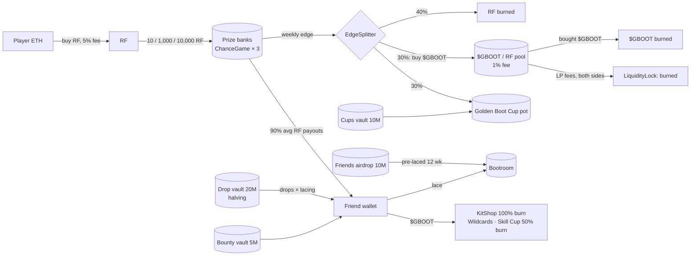

# Penalty Kings economy (tokenomics v2)

**Status:** the public preview's economy is **simulated**. The v2 contracts in `contracts/src` and
`contracts/script/Launch.s.sol` are **not deployed**. [DEPLOYMENT.md](DEPLOYMENT.md) says exactly
what is live on Robinhood mainnet (chain 4663) and links every transaction. Read the
[legal note](#legal-note) before anything else.

Every number below comes from the contracts and the game constants. The formulas are shown next
to the numbers. The tables between `SIM` markers are written by `node scripts/economy-sim.mjs`.
That script first checks that the Solidity sources still hold the constants it uses
(`scripts/lib/tokenomics.mjs`, `checkContracts()`), and it stops with an error if they do not.

## RF first

**You play Penalty Kings with RF.** A ball costs 10 RF (Park), 1,000 RF (Pro) or 10,000 RF
(Champions). Every ball is backed by RF in its stadium's prize bank, and you can redeem it for RF.
The on-chain randomness sets how much RF a ball pays: from 0× to 10× its price, and 90% of the
price on average.

**$GBOOT is optional.** It is a bonus layer for skill and loyalty: drops on each ball, lacing
boosts, Skill Cup entries, Wildcards and cosmetics. You never need $GBOOT to buy a ball, to
place it, to redeem it or to enter the Golden Boot Cup. A player who ignores $GBOOT gets exactly
the same RF odds.

## How the money moves (v2)

1. **Players buy RF with ETH.** Every RF buy and sell pays Rare Friends' 5% market fee on the ETH
   side. That fee goes to active Friend holders as WETH.
2. **RF buys balls.** The RF goes into the stadium's prize bank, a FriendSDK `ChanceGame`
   contract. The bank reserves the top prize (10 × price) for every ball until the ball settles.
3. **Dice randomness draws a rarity for each ball.** The rarity fixes:
   - the ball's RF value;
   - its $GBOOT drop;
   - its Golden Boot Cup race points.
   **The kick decides no money.**
4. **The 10% edge is split on-chain every week.** The surplus above the opening bank is sent to
   `EdgeSplitter`, less 10% that a growing bank keeps as operator policy. The contract splits it:
   - **40% of the RF is burned**;
   - **30% of the RF buys $GBOOT**, and that $GBOOT is burned (buy-and-burn);
   - **30% of the RF goes to the Golden Boot Cup**.
5. **Pool fees are burned on both sides.** The $GBOOT/RF Uniswap v4 pool charges a 1% fee.
   `LiquidityLock.collectAndBurn` is permissionless and burns the RF side and the $GBOOT side.
6. **$GBOOT comes out of capped vaults only.** Drops, Cups and the bounty come from
   `EmissionVault`s. Each vault has an immutable weekly cap, and the drop vault's cap halves every
   4 weeks.
7. **$GBOOT sinks:**
   - KitShop cosmetics: 100% burned;
   - Wildcards and Skill Cup entries: 50% burned, 50% to the pot;
   - Bootroom early unlace: 50% burned.



## $GBOOT token and allocation

- **Supply:** `GBoot.TOTAL_SUPPLY` = 100,000,000, minted once at deployment.
- **Admin powers:** none. There is no owner, mint, pause, tax or blacklist. Holders can burn
  their own tokens.
- **Allocation:** `Launch.s.sol` distributes the whole supply in one sequence and checks
  `require(balanceOf(operator) == POOL_GBOOT)`.

| Share | Amount | Where | Release rule (immutable) |
|---:|---:|---|---|
| 55% | 55,000,000 | Pool position A, owned by `LiquidityLock` | Sold only to buyers, from ≈ 0.1003 RF upwards. Locked 180 days (`UNLOCK_DAYS`) |
| 20% | 20,000,000 | Drop vault (`EmissionVault`, halving) | `capOf(w) = 2,500,000 >> ⌊w / 4⌋` per week |
| 10% | 10,000,000 | `FriendsAirdrop` | Merkle claim, laced in the Bootroom for 12 weeks. After 180 days, unclaimed tokens can be swept to the Cups vault |
| 10% | 10,000,000 | Cups & events vault (`EmissionVault`, flat) | ≤ 100,000 per week (100 weeks) |
| 5% | 5,000,000 | FINAL WALL bounty vault (`EmissionVault`, flat) | ≤ 50,000 per week (100 weeks) |
| 0% | — | Team | none |

- **Operator:** each vault has one operator, the disclosed game burner
  `0xDB454B035777692EB6bd599297781a7ACC3A25e4`. The operator can only call `release` up to the
  current week's cap. Even a compromised key could take no more than one week's cap per vault.
- **Price:** the pool starts at the tick-snapped price P₀ = 1.0001^tick ≈ **0.10027 RF per
  $GBOOT**, so the FDV is 100M × P₀ ≈ **10.03M RF**
  (`scripts/onchain/pool-plan.mjs`: fee 1%, tick spacing 200, no hook).

## Supply over time

The weekly drop cap is `EmissionVault.capOf(w) = weeklyCap >> ⌊w / halvingWeeks⌋`, with
weeklyCap = 2.5M and halvingWeeks = 4. Each 4-week season can therefore release at most 10M,
then 5M, then 2.5M, and so on. After *s* whole seasons the vault can have released at most
**20M × (1 − 2⁻ˢ)**: it approaches 20M and never passes it. The Cups and bounty vaults are flat:
at most 100,000 × *w* and 50,000 × *w* after *w* weeks, until they are empty at week 100.

Total supply only goes down. It equals 100M minus everything burned. Vault releases move tokens
into circulation but do not change the total supply.

<!-- SIM:supply:START -->
_Generated by `node scripts/economy-sim.mjs` from the contracts and game constants (market snapshot: block 73,657,545, 1 RF = $0.00154, 1 ETH = 1,746,601 RF)._

**Schedule (independent of volume).** Week *w* counts from the vault's `start` (week 0 = launch week). Caps are upper bounds; a week's unused cap is lost.

| After week | Drop cap in the last week | Drops released, max (Σ capOf) | Drop vault left, min | Cups vault released, max | Bounty vault released, max | Airdrop unlocked, max | **Max $GBOOT released from vaults** |
|---:|---:|---:|---:|---:|---:|---:|---:|
| 0 | — | 0 | 20,000,000 | 0 | 0 | 0 | **0** |
| 4 | 2,500,000 | 10,000,000 | 10,000,000 | 400,000 | 200,000 | 0 | **10,600,000** |
| 8 | 1,250,000 | 15,000,000 | 5,000,000 | 800,000 | 400,000 | 0 | **16,200,000** |
| 12 | 625,000 | 17,500,000 | 2,500,000 | 1,200,000 | 600,000 | 10,000,000 | **29,300,000** |
| 16 | 312,500 | 18,750,000 | 1,250,000 | 1,600,000 | 800,000 | 10,000,000 | **31,150,000** |
| 26 | 39,063 | 19,765,625 | 234,375 | 2,600,000 | 1,300,000 | 10,000,000 | **33,665,625** |
| 52 | 610 | 19,997,559 | 2,441 | 5,200,000 | 2,600,000 | 10,000,000 | **37,797,559** |
| 78 | 5 | 19,999,971 | 29 | 7,800,000 | 3,900,000 | 10,000,000 | **41,699,971** |
| 104 | 0 | 20,000,000 | 0 | 10,000,000 | 5,000,000 | 10,000,000 | **45,000,000** |

**Total supply (100M minus everything burned), price-responsive.** Each week the edge buy-back buys $GBOOT through the launch positions (A: 55M $GBOOT from 0.1003 RF up; B: a 250,000 RF floor from 0.0101 to 0.0983 RF) and burns it; then drops (auto-scaled to the new price, all at the maximum ×1.5 boost), the full Cups and bounty caps and, at week 12, the whole airdrop are released and **50% of every release is sold** into the pool. Burns counted: the buy-back only; Skill Cup, Wildcard, KitShop, early-unlace and LP-fee burns are extra. These are stress assumptions, not forecasts.

| Scenario | Ball volume / week | Week 0 | Week 26 | Week 52 | Week 104 | $GBOOT burned by wk 104 | Drops paid by wk 104 | Price wk 104 (RF) |
|---|---:|---:|---:|---:|---:|---:|---:|---:|
| no play | 0 RF ($0.00) | 100,000,000 | 100,000,000 | 100,000,000 | 100,000,000 | 0 | 0 | 0.0101 |
| 50 players/day | 301,000 RF ($464) | 100,000,000 | 94,495,715 | 90,594,788 | 86,049,162 | 13,950,838 | 2,429,473 | 0.1016 |
| 500 players/day | 3,010,000 RF ($4,639) | 100,000,000 | 80,500,962 | 67,869,269 | 53,463,281 | 46,536,719 | 11,772,532 | 0.3992 |
| 5,000 players/day | 30,100,000 RF ($46,389) | 100,000,000 | 42,321,131 | 33,465,109 | 26,821,177 | 73,178,823 | 20,000,000 | 9.2951 |

```text
Drop vault: weekly cap (halves every 4 weeks)            cumulative drops released (max, of 20M)
wk   0 ████████████████████████ 2,500,000   ███·····················   2.50M
wk   4 ████████████············ 1,250,000   ██████████████··········  11.25M
wk   8 ██████··················   625,000   ███████████████████·····  15.63M
wk  12 ███·····················   312,500   █████████████████████···  17.81M
wk  16 ██······················   156,250   ███████████████████████·  18.91M
wk  20 █·······················    78,125   ███████████████████████·  19.45M
wk  24 ························    39,063   ████████████████████████  19.73M
wk  28 ························    19,531   ████████████████████████  19.86M
wk  32 ························     9,766   ████████████████████████  19.93M
wk  36 ························     4,883   ████████████████████████  19.97M
wk  40 ························     2,441   ████████████████████████  19.98M
wk  44 ························     1,221   ████████████████████████  19.99M
wk  48 ························       610   ████████████████████████  20.00M
wk  52 ························       305   ████████████████████████  20.00M

Total supply, "5,000 players/day" (axis 25.00M … 100.00M $GBOOT)
wk   0 ████████████████████████████████████████ 100.00M
wk   8 ██████████████████████··················  66.13M
wk  16 ██████████████··························  51.59M
wk  24 ██████████······························  43.64M
wk  32 ████████································  39.23M
wk  40 ██████··································  36.37M
wk  48 █████···································  34.31M
wk  56 ████····································  32.71M
wk  64 ███·····································  31.40M
wk  72 ███·····································  30.28M
wk  80 ██······································  29.30M
wk  88 ██······································  28.40M
wk  96 █·······································  27.58M
wk 104 █·······································  26.82M
```
<!-- SIM:supply:END -->

**Reading the table:**
- The halving front-loads drops. Up to 50% of the drop vault can go out in the first 4 weeks, but
  only when there is enough volume. Drops are `min(volume-based, capOf)`, and the
  "50 players/day" row pays only a fraction of the cap.
- The "no play" row shows that releases without volume push the price down to the RF floor's
  bottom (≈ 0.01 RF). The total supply does not move, because nothing is burned without play.

## Burns and the deflation needed per volume

The formulas below are per unit of ball volume V (RF):

- edge = 0.10 V (from the odds table; `verify-odds` asserts it);
- sweep = edge × (1 − 0.10), because a growing bank keeps 10%;
- RF burned = 40% × sweep;
- $GBOOT burned = 30% × sweep × 0.99 ÷ P, where 0.99 accounts for the pool fee;
- Cup = 30% × sweep.

Drops emitted are 2% × V × dropBoost ÷ TWAP. The base drop is 2% of the ball price at ×1
(`economy.ts`: 0.93 / 93 / 930 = 2% × price ÷ 0.1 ÷ 2.15), and the Bootroom can raise it to
×1.5.

<!-- SIM:burn:START -->
_Generated by `node scripts/economy-sim.mjs` from the contracts and game constants (market snapshot: block 73,657,545, 1 RF = $0.00154, 1 ETH = 1,746,601 RF)._

Per **1 RF of ball volume** (expected values; the edge is 10%, the growing bank keeps 10% of it):

| Path | Formula | RF per RF of volume | Per $1 of volume |
|---|---|---:|---:|
| RF burned by EdgeSplitter | 0.10 × (1 − 0.10) × 40% | 0.0360 RF | 23.4 RF |
| RF swapped for $GBOOT (buy-back) | 0.10 × 0.90 × 30% | 0.0270 RF | 17.5 RF |
| … its 1% LP fee, burned by LiquidityLock | 0.027 × 1% | 0.00027 RF | 0.18 RF |
| **$GBOOT bought and burned** | 0.027 × 0.99 ÷ P | **0.2666 $GBOOT** at P = 0.10027 | **173.0 $GBOOT** |
| RF to the Golden Boot Cup | 0.10 × 0.90 × 30% | 0.0270 RF | 17.5 RF |
| **Total RF burned** | 0.036 + 0.00027 | **0.03627 RF** | **23.5 RF** |
| $GBOOT dropped (emitted) | 2% ÷ TWAP × dropBps | 0.1995 … 0.2992 $GBOOT (×1 … ×1.5) | 129.4 … 194.1 $GBOOT |

Both sides scale as 1 ÷ price, so the ratio is price-independent: burned ÷ dropped = 2.673% ÷ (2% × average drop boost). **Ball play is net deflationary for $GBOOT whenever the average drop boost is below ×1.3365**; at the maximum ×1.5 it emits 0.327% of volume in $GBOOT value more than it burns, until the season cap binds.

Pool trading adds more: every swap pays 1% and `LiquidityLock.collectAndBurn` burns both fee sides, so **1 RF of $GBOOT trading volume burns 0.01 RF-equivalent** (RF on buys, $GBOOT on sells) while the positions stay locked (180 days).

**Break-even weekly ball volume** (burns = emissions, the flat Cups + bounty releases of 150,000 $GBOOT included, all vaults releasing their full cap):

| Week | Drop cap | Avg drop boost ×1.0 | ×1.25 | ×1.5 |
|---:|---:|---:|---:|---:|
| 0 | 2,500,000 | 2,234,852 RF ($3,444) | 8,693,963 RF ($13,399) | 9,940,759 RF ($15,320) |
| 4 | 1,250,000 | 2,234,852 RF ($3,444) | 5,251,722 RF ($8,094) | 5,251,722 RF ($8,094) |
| 8 | 625,000 | 2,234,852 RF ($3,444) | 2,907,203 RF ($4,480) | 2,907,203 RF ($4,480) |
| 12 | 312,500 | 1,734,944 RF ($2,674) | 1,734,944 RF ($2,674) | 1,734,944 RF ($2,674) |
| 16 | 156,250 | 1,148,814 RF ($1,770) | 1,148,814 RF ($1,770) | 1,148,814 RF ($1,770) |
| 20 | 78,125 | 855,749 RF ($1,319) | 855,749 RF ($1,319) | 855,749 RF ($1,319) |
| 24 | 39,063 | 709,217 RF ($1,093) | 709,217 RF ($1,093) | 709,217 RF ($1,093) |
| 52 | 305 | 563,829 RF ($869) | 563,829 RF ($869) | 563,829 RF ($869) |

Formula: with *b* = 0.02673 ÷ P $GBOOT burned per RF and *d* = 0.02 × boost ÷ P dropped per RF, the break-even volume is V = 150,000 ÷ (b − d) while drops are under the cap, else V = (capOf(week) + 150,000) ÷ b. Above it, total supply falls faster than vaults release.
<!-- SIM:burn:END -->

## Lacing scenarios (the Bootroom)

- **Lacing:** you lock $GBOOT against a Friend for 1–52 weeks with `Bootroom.lace`. Anyone can
  lace for any Friend. Only the Friend's owner, or its token-bound account, can unlace.
- **Early unlace:** unlacing before expiry burns 50%.
- **Boost formula:** `boostBps = 10,000 × (1 + log₂(1 + x) ÷ log₂(1 + 520,000))`, capped at
  ×2, where x = min(amount, 10,000) × lockWeeks.
- **What the boost does:**
  - it multiplies the Friend's **Golden Boot race points**;
  - drops get `dropBps = 1 + (boost − 1) ÷ 2`, so ×1 to ×1.5.
- **Expiry:** an expired lace gives ×1. The boost uses the committed `lockWeeks`, not the time
  left.

<!-- SIM:lacing:START -->
_Generated by `node scripts/economy-sim.mjs` from the contracts and game constants (market snapshot: block 73,657,545, 1 RF = $0.00154, 1 ETH = 1,746,601 RF)._

Race-point boost (drop boost in brackets) for a live lace of *amount* $GBOOT committed for *weeks*:

| Laced | 1 wk | 4 wk | 12 wk | 26 wk | 52 wk |
|---:|---:|---:|---:|---:|---:|
| 1 | ×1.05 (×1.03) | ×1.12 (×1.06) | ×1.19 (×1.10) | ×1.25 (×1.13) | ×1.30 (×1.15) |
| 100 | ×1.35 (×1.18) | ×1.46 (×1.23) | ×1.54 (×1.27) | ×1.60 (×1.30) | ×1.65 (×1.32) |
| 1,000 | ×1.52 (×1.26) | ×1.63 (×1.31) | ×1.71 (×1.36) | ×1.77 (×1.39) | ×1.82 (×1.41) |
| 10,000 | ×1.70 (×1.35) | ×1.81 (×1.40) | ×1.89 (×1.44) | ×1.95 (×1.47) | ×2.00 (×1.50) |
| 50,000 | ×1.70 (×1.35) | ×1.81 (×1.40) | ×1.89 (×1.44) | ×1.95 (×1.47) | ×2.00 (×1.50) |

What a boost is worth, per Park ball (10 RF) at the launch price:

| Boost | Drops per ball (avg, $GBOOT) | Drop value | RF return + drop value | Race points per 100 balls |
|---:|---:|---:|---:|---:|
| ×1.00 | 1.995 | 2.00% | 92.00% | 4.50 |
| ×1.35 | 2.344 | 2.35% | 92.35% | 6.08 |
| ×1.54 | 2.532 | 2.54% | 92.54% | 6.92 |
| ×1.89 | 2.881 | 2.89% | 92.89% | 8.50 |
| ×2.00 | 2.992 | 3.00% | 93.00% | 9.00 |
<!-- SIM:lacing:END -->

**What this means:**
- **Cheap boosts at the low end:** the log scale makes small laces worth a lot. 100 $GBOOT
  (≈ 10 RF) laced for one week already gives ×1.35 race points. The design is generous to small
  holders, and the cap stops any one Friend going past ×2.
- **Race points are not sybil-neutral once laced:** they are no longer "RF per point" alone.
  Splitting RF across many Friends still gains nothing. But a laced Friend earns up to 2× the
  points per RF of an unlaced one, and the weekly report publishes every boost it applies.
- **Drops stay within the farm limit:** even at ×1.5, RF return plus drop value is ≤ 93% of the
  ball price. Balls can never be a profitable farm.

## Airdrop sizing (Friends airdrop, 10M)

- **Setup:** the deployer sets the Merkle root once. The leaf is `keccak256(abi.encode(friendId,
  amount))`.
- **Claiming:** a claim never pays a wallet. It laces the amount for that Friend for 12 weeks,
  so every eligible Friend starts with a boost.
- **Eligibility:** the rules are published with the root and apply identically to every Friend.
  For example: every Friend hardwired at a published snapshot block, with an equal share each.
  They must not favour any wallet.

<!-- SIM:airdrop:START -->
_Generated by `node scripts/economy-sim.mjs` from the contracts and game constants (market snapshot: block 73,657,545, 1 RF = $0.00154, 1 ETH = 1,746,601 RF)._

Equal split of 10,000,000 $GBOOT across N eligible Friends, each laced for 12 weeks:

| Eligible Friends N | $GBOOT per Friend | ≈ RF at launch price | Counted for the boost (≤ 10,000) | Boost for 12 weeks (drops) | Uncounted $GBOOT (no extra boost) |
|---:|---:|---:|---:|---:|---:|
| 250 | 40,000 | 4,011 | 10,000 | ×1.89 (×1.44) | 7,500,000 |
| 500 | 20,000 | 2,005 | 10,000 | ×1.89 (×1.44) | 5,000,000 |
| 1,000 | 10,000 | 1,003 | 10,000 | ×1.89 (×1.44) | 0 |
| 2,000 | 5,000 | 501 | 5,000 | ×1.84 (×1.42) | 0 |
| 5,000 | 2,000 | 201 | 2,000 | ×1.77 (×1.38) | 0 |
| 10,000 | 1,000 | 100 | 1,000 | ×1.71 (×1.36) | 0 |
| 20,000 | 500 | 50 | 500 | ×1.66 (×1.33) | 0 |

Unclaimed $GBOOT can be swept to the Cups & events vault after the 180-day window (≈ 25.7 weeks). The vault's flat 100,000/week cap does not change, so a sweep of S $GBOOT extends its runway by S ÷ 100,000 weeks (a full 10M sweep: +100 weeks).
<!-- SIM:airdrop:END -->

**The sizing rule:** only the first 10,000 $GBOOT laced per Friend count towards the boost
(`MAX_LACE`). A per-Friend amount above 10,000 buys no extra boost; that is the case whenever
N < 1,000 eligible Friends under an equal split. A cap of 10,000 per Friend, with any remainder
left to the claim-window sweep, uses the whole 10M for boosts.

## Sudden Death solvency

In a Big Match, 3+ goals in the first 5 kicks unlock Sudden Death: every goal scores ×2 until the
first miss.

<!-- SIM:suddendeath:START -->
_Generated by `node scripts/economy-sim.mjs` from the contracts and game constants (market snapshot: block 73,657,545, 1 RF = $0.00154, 1 ETH = 1,746,601 RF)._

Big Match rule: after 5 kicks with 3+ goals, every further goal scores ×2 until the first miss. Expected extra kicks for goal rate *p* (geometric run) and the most one kick can score (`packages/engine` goalPoints: 100 × keeper ≤ 2.5 × ball × streak ≤ 3 × Sudden Death 2 × top bin 5 × post-in 1.5):

| Goal rate p | P(reach Sudden Death) = P(≥3 of 5) | Expected Sudden Death kicks, p ÷ (1 − p) | P(run ≥ 10 goals) = p¹⁰ |
|---:|---:|---:|---:|
| 55% | 59.3% | 1.22 | 0.25% |
| 60% | 68.3% | 1.50 | 0.60% |
| 65% | 76.5% | 1.86 | 1.35% |

Largest single-kick score ≤ 11,250 points × the ball multiplier. **Points carry zero RF or $GBOOT liability**: every RF payout was fixed by Dice when the ball was placed (the prize bank reserved 10 × price for it), and the Skill Cup referee scores with Sudden Death off (`verifier/src/core.ts`: `goalPoints(…, false, …)`) over exactly 5 kicks.
<!-- SIM:suddendeath:END -->

- **The same rule covers every skill prize.** Anything paid for skill comes from a fixed pot or a
  capped vault, and it is paid by rank or by a rule that is published before the week starts.
  Nothing is paid per point.
- **The bounty vault:** the most any week of FINAL WALL bounties can pay is its cap:
  `capOf = 50,000` $GBOOT. If claims exceed the cap, they are paid pro rata or rolled to the
  next week. They are never paid from the prize banks.
- **Sizing a per-goal bounty:** a bounty of *b* $GBOOT per Sudden Death goal costs
  *b* × p ÷ (1 − p) per qualifying match on average, which is 1.5 *b* at p = 60%. Size *b*
  so that the expected claims stay under 50,000 a week.

## Prize-bank solvency and capacity

Every stadium uses the same outcome table:

- chances 31.5% / 27% / 20% / 11% / 7% / 2.5% / 1%;
- payouts 0 / 0.5 / 1 / 1.5 / 2.5 / 5 / 10 × the ball price.

The expected payout is exactly 0.90 (`scripts/verify-odds.mjs`, run in CI). A stadium can hold
free bank ÷ (10 × price) balls in flight. When a stadium is full, the game says so before any
transaction.

<!-- SIM:solvency:START -->
_Generated by `node scripts/economy-sim.mjs` from the contracts and game constants (market snapshot: block 73,657,545, 1 RF = $0.00154, 1 ETH = 1,746,601 RF)._

Per ball, in units of the ball price: mean payout 0.90, standard deviation **1.329**, edge **0.10**, variance 1.768.

| Loss barrier (ball prices) | Simulated P(ever reached) | Normal approx. exp(−2·edge·N/σ²) | Exact upper bound exp(−θ·N), θ = 0.0944 |
|---:|---:|---:|---:|
| 10 | 3.22e-1 | 3.23e-1 | 3.89e-1 |
| 20 | 1.24e-1 | 1.04e-1 | 1.51e-1 |
| 30 | 4.87e-2 | 3.36e-2 | 5.89e-2 |
| 40 | 1.90e-2 | 1.08e-2 | 2.29e-2 |
| **100** | (too rare to sample) | 1.22e-5 | **7.93e-5** |

20,000 runs × 20,000 balls per barrier. The exact Lundberg bound sits above every simulated value, so "a bank ever falls 100 ball prices below its start" has probability **at most ≈ 8e-5**. Only the surplus above the opening bank is swept (high-water sweep), so the drift always applies below the start.

| Stadium | Ball | Top prize | Opening bank | Balls in flight (bank ÷ top prize) |
|---|---:|---:|---:|---:|
| park | 10 RF | 100 RF | 20,000 RF | 200 |
| pro | 1,000 RF | 10,000 RF | 200,000 RF | 20 |
| champions | 10,000 RF | 100,000 RF | 2,000,000 RF | 20 |
<!-- SIM:solvency:END -->

## Golden Boot Cup and Skill Cup

**Golden Boot Cup (weekly: luck and volume)**

- **Pot sources:**
  - 30% of the swept edge (`EdgeSplitter`);
  - 50% of Wildcard spend;
  - up to 100,000 $GBOOT a week from the Cups vault;
  - an optional RF seed.
- **Race points:**
  - Gold = 1 point and Golden Boot = 2 points;
  - × the stadium weight (Park 1, Pro 100, Champions 1,000, the same as the price ratio);
  - × the Friend's Bootroom boost.
- **Payouts:** the top 10 are paid 25 / 18 / 13 / 10 / 8 / 7 / 6 / 5 / 4 / 4 %.
- **Wildcards:** 100 $GBOOT buys one extra draw (`Wildcards.PRICE`), with 1% Golden Boot and
  2.5% Gold odds. At the launch price that is ≈ 10 RF, the same gross price as a Park ball but
  with no RF payout. The farm check below shows that balls stay the cheaper route to race points
  unless $GBOOT falls below ≈ 0.098× its launch price.

**Skill Cup (weekly: skill)**

- **Entry:** `SkillCup.ENTRY` = 100 $GBOOT. 50% is burned and 50% goes to the pot.
- **Eligibility:** Friends hardwired at Gen 4 or better.
- **Limits:** one entry per Friend per hour and 20 per week.
- **Refereeing:** the referee (`verifier/`) replays 5 kicks per entry against a keeper whose dive
  is derived from a secret committed in advance. It scores without Sudden Death.
- **Status:** simulated in the preview. Going live needs a bridge extension from Rare Friends
  (recorded as a capability gap).

## $GBOOT pool

- **Venue:** Uniswap v4, $GBOOT/RF, 1% fee, no hook.
- **Position A:** 55M $GBOOT single-sided from P₀ up to ≈ 99.46 RF (≈ 1,000×). It needs no RF.
- **Position B:** optional. An RF floor from ≈ 0.01 to ≈ 0.098 RF. That RF is at market risk: it
  turns into $GBOOT if $GBOOT is sold down.
- **Lock:** both positions belong to `LiquidityLock` until the unlock time (180 days by default).
  After that the beneficiary (the burner) can withdraw the NFTs.
- **Fees:** LP fees are burned on both sides only while the lock holds the positions.

<!-- SIM:pool:START -->
_Generated by `node scripts/economy-sim.mjs` from the contracts and game constants (market snapshot: block 73,657,545, 1 RF = $0.00154, 1 ETH = 1,746,601 RF)._

Position A: 55,000,000 $GBOOT single-sided from 0.10027 to 99.46 RF per $GBOOT (tick-snapped by pool-plan.mjs). L = 17,987,135. Start FDV = 100M × 0.10027 = **10,027,037 RF** ($15,453). RF in = L·(√P₁ − √P₀) ÷ 0.99; $GBOOT out = L·(1/√P₀ − 1/√P₁).

| Price move | New price (RF) | RF that must flow in | ≈ USD | $GBOOT bought out of the pool |
|---|---:|---:|---:|---:|
| ×2 | 0.201 | 2,383,073 | $3,673 | 16,637,382 |
| ×10 | 1.003 | 12,440,120 | $19,172 | 38,840,709 |
| ×100 | 10.027 | 51,779,235 | $79,799 | 51,123,219 |
<!-- SIM:pool:END -->

## Farm checks

The live drop base is `min(schedule, 2% × ball price ÷ TWAP ÷ 2.15)`, capped each week by the
drop vault's `capOf`. It is published in [DROPS.md](DROPS.md) before that week's drops are paid.

<!-- SIM:farm:START -->
_Generated by `node scripts/economy-sim.mjs` from the contracts and game constants (market snapshot: block 73,657,545, 1 RF = $0.00154, 1 ETH = 1,746,601 RF)._

RF payout is always 90%. Drops are valued at the $GBOOT TWAP, at the maximum lacing boost (×1.5):

| $GBOOT price | Drop value, fixed schedule | Total, fixed | Drop value, auto-scaled | **Total, auto-scaled** |
|---|---:|---:|---:|---:|
| 0.1× (0.0100 RF) | 0.30% | 90.30% | 0.30% | **90.30%** |
| 1× (0.1003 RF) | 3.01% | 93.01% | 3.00% | **93.00%** |
| 10× (1.0027 RF) | 30.07% | 120.07% | 3.00% | **93.00%** |
| 100× (10.0270 RF) | 300.74% | 390.74% | 3.00% | **93.00%** |

### Wildcard farm check (RF cost per Golden Boot race point)

A Park ball costs 10 RF and returns 9 RF on average plus its drop; a Wildcard costs 100 $GBOOT and returns nothing. Both give 0.045 expected race points, and the lacing boost multiplies both equally.

| $GBOOT price | Park ball, net RF per point | Wildcard, RF per point | Cheaper route |
|---|---:|---:|---|
| 0.5× (0.0501 RF) | 19.99 | 111.41 | balls |
| 1× (0.1003 RF) | 17.78 | 222.82 | balls |
| 10× (1.0027 RF) | 17.78 | 2,228.23 | balls |
| 100× (10.0270 RF) | 17.78 | 22,282.31 | balls |

Break-even: 100·P = 1 − 2.000·P ⇒ Wildcards only become cheaper per point below P = 0.00980 RF (≈ 0.098× launch). The weekly report flags any week where the TWAP is under it.
<!-- SIM:farm:END -->

## Weekly scale table

<!-- SIM:scale:START -->
_Generated by `node scripts/economy-sim.mjs` from the contracts and game constants (market snapshot: block 73,657,545, 1 RF = $0.00154, 1 ETH = 1,746,601 RF)._

Assumptions: 80% of players at park × 15 balls/day, 18% of players at pro × 3 balls/day, 2% of players at champions × 1 balls/day; 5% of a stadium's daily players have a ball in flight at the peak; 25% of RF spent is bought fresh with ETH. Burn and Cup figures use the realised surplus of the simulated week (luck included), after the 10% growth retention. Drops at ×1 boost, before and after the drop vault's week-0 and week-26 caps.

| Daily players | RF spent / wk | RF burned (40%) | $GBOOT bought & burned (30%) | Cup RF (30%) | Friend fees / wk | Drops / wk (uncapped) | Cap wk 0 / wk 26 binds? | Peak bank need vs opening bank |
|---:|---:|---:|---:|---:|---:|---:|---|---|
| 50 | 301,000 RF ($464) | 13,236 RF | 98,010 | 9,927 RF | 0.002 ETH | 59,106 | no / yes | 200 / 10,000 / 100,000 vs 20,000 / 200,000 / 2,000,000 |
| 500 | 3,010,000 RF ($4,639) | 109,975 RF | 814,365 | 82,482 RF | 0.023 ETH | 599,781 | no / yes | 2,000 / 50,000 / 100,000 vs 20,000 / 200,000 / 2,000,000 |
| 5,000 | 30,100,000 RF ($46,389) | 1,050,879 RF | 7,781,737 | 788,159 RF | 0.227 ETH | 6,017,270 | yes / yes | 20,000 / 450,000 / 500,000 vs 20,000 / 200,000 / 2,000,000 |

Skill Cup (100 $GBOOT) and Wildcards (100 $GBOOT) burn 50% of every entry on top: each 1,000 entries burn 50,000 $GBOOT.
<!-- SIM:scale:END -->

## Why hold $GBOOT

These are the things $GBOOT *does* in the game. None of them is a promise about its price.

- **Lace your boots.** Lacing $GBOOT against your Friend multiplies its Golden Boot Cup race
  points (up to ×2) and its drops (up to ×1.5). The Cup pot is paid in RF.
- **Enter the Skill Cup.** Entry costs 100 $GBOOT per shootout, and the Cup is the only prize in
  the game decided by skill.
- **Buy Wildcards.** 100 $GBOOT buys an extra Golden Boot draw.
- **Buy cosmetics.** Boots, kits, nets and celebrations from the KitShop (the $GBOOT is burned).
- **Fixed rules:** a fixed supply, no team allocation, no owner or mint, capped vaults, and burns
  that are written into the contracts. Anyone can check them on-chain.

**The downsides, just as plainly:**
- $GBOOT can fall to a small fraction of its launch price, or to zero.
- Early unlace burns half of the lace.
- The pool positions unlock after 180 days.
- Boosts end when a lace expires.
- Holding $GBOOT never changes the RF odds of a ball.

## Legal note

- **Not investment advice.** Nothing in this repository is investment, financial, legal or tax
  advice, or an offer to sell anything.
- **No promise of returns.** $GBOOT is a game token with in-game uses. Nobody promises it any
  price, yield, buy-back volume or return. The burns and caps above describe what the contracts
  do; they are not a forecast. The projections use stated stress assumptions and will be wrong in
  practice.
- **How the game's prizes work:** the game's RF prizes are decided by **on-chain randomness**
  (Dice), with a **90% average return** per ball. The kick, the player's skill, lacing and
  $GBOOT do not change these odds. Over many balls a player should expect to get back less RF
  than they spend.
- **Legal review:** token-priced random rewards need legal review in each jurisdiction before any
  official launch. Play only where it is lawful for you.

## Creator commitments

- **Edge splits:** the weekly edge goes through `EdgeSplitter`, never by hand. Its 40/30/30 split
  is fixed in the contract.
- **Weekly report:** [WEEKLY.md](WEEKLY.md) gets a report every week. It covers:
  - the edge split transaction;
  - vault releases against `capOf`;
  - every Bootroom boost applied;
  - the drop base;
  - the Cup table.

  `node scripts/cup/weekly.mjs` computes it from on-chain events. It is a dry run that only
  reads and never signs.
- **Burns** use each token's `burn`, never a transfer to a dead address.

## Roadmap

- **v1.2:** `contracts/src/GBootFeeHook.sol` burns a 1% hook fee on both sides inside every
  swap. It is **not deployed** and needs an audit and Rare Friends review first.
- **Later:**
  - PvP keepers on the same replay referee;
  - clubs and seasons;
  - stadium naming rights auctioned for $GBOOT (burned).
